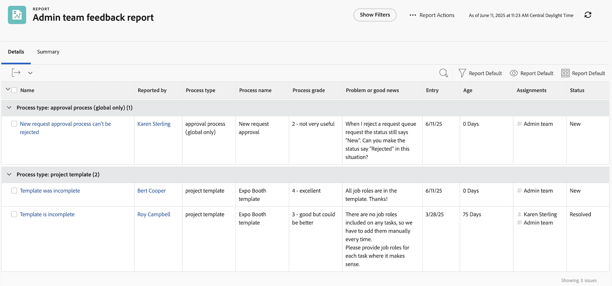

# Crie um relatório de tarefas

Neste vídeo, você aprenderá:

* Como criar um relatório de tarefas com um filtro complexo
* Como localizar os relatórios que você cria

>[!VIDEO](https://video.tv.adobe.com/v/335154/?quality=12&learn=on)

>[!TIP]
>
>Quebre suas espátulas e tigelas de mistura e prepare-se para experimentar as &quot;receitas&quot; em nossa [Guia de relatórios do cliente do Adobe Workfront](/help/assets/workfront-customer-reporting-cookbook.pdf). Lá dentro você encontrará instruções passo a passo para 10 relatórios, prontos para serem exibidos em seu ambiente hoje.
>Reunimos os relatórios favoritos dos clientes e os reunimos em um livro de receitas que pode ser lanchado, de fácil digestão, para que você possa levá-los de volta e testá-los em sua própria cozinha do Workfront.
>Esses 10 relatórios vêm de clientes que são exatamente como você. Espalhados por setores, departamentos, equipes, posições e tudo em diferentes empresas, devemos um enorme agradecimento aos clientes incríveis que compartilharam um de seus relatórios favoritos. Alguns relatórios são simples (mas incrivelmente úteis) e outros são mais complexos para elevar o nível dos seus relatórios.

## Atividade 1: criar um relatório de observações com prompts

Crie um relatório de notas que você pode usar para pesquisar notas do usuário (ou seja, comentários ou atualizações) ou notas do sistema com base no conteúdo da nota, no autor, na data de entrada, no nome do projeto ou no tipo de auditoria. Nomeie o relatório como &quot;Pesquisa de notas&quot;.

Ao usar o prompt de texto da nota, este relatório pesquisará nas threads de atualização para extrair rapidamente qualquer um que atenda aos critérios especificados nos prompts. Ao executar o relatório, não é necessário preencher todos os prompts, apenas aqueles com os quais você se importa. Os que estão branco são automaticamente ignorados.

A visualização deve incluir colunas para:

* Texto da Nota
* Texto de Auditoria
* Data de Entrada
* Proprietário: nome
* Tipo de Auditoria
* Nome da tarefa
* Nome do Problema

Deixe a guia do filtro em branco.

Grupo no nome do projeto.

Inclua prompts para o seguinte:

* Texto de Auditoria
* Texto da Nota
* Nome do proprietário
* Data de Entrada
* Nome do Projeto
* Tipo de Auditoria

## Resposta da atividade 1

1. Selecione **[!UICONTROL Relatórios]** no **[!UICONTROL Menu principal]**.
1. Clique no menu **[!UICONTROL Novo relatório]** e selecione **[!UICONTROL Nota]**.
1. Em **[!UICONTROL Colunas (Visualização)]** configure as colunas para incluir:

   

   * [!UICONTROL Nota] > [!UICONTROL Texto da Nota]
   * [!UICONTROL Nota] > [!UICONTROL Texto de auditoria]
   * [!UICONTROL Nota] > [!UICONTROL Data de entrada]
   * [!UICONTROL Proprietário] > [!UICONTROL Nome]
   * [!UICONTROL Nota] > [!UICONTROL  Tipo de auditoria]
   * [!UICONTROL Tarefa] > [!UICONTROL Nome]
   * [!UICONTROL Problema] > [!UICONTROL Nome]

1. Selecione a coluna **[!UICONTROL Data de entrada]** e altere **[!UICONTROL Classificar para decrescente]**.
1. Na guia **[!UICONTROL Agrupamentos]**, configure o relatório para agrupar por [!UICONTROL Projeto] > [!UICONTROL Nome].

   

1. Deixe [!UICONTROL Filtros] em branco.
1. Abertura **[!UICONTROL Configurações do relatório]** e nomeie o relatório como &quot;Pesquisa de Notas&quot;.
1. No [!UICONTROL Descrição] , coloque algo como, &quot;Procure por notas do sistema ou do usuário com base no Tipo de auditoria selecionado e em outros prompts. As notas do sistema são exibidas na coluna Texto de auditoria e as notas do usuário são exibidas na coluna Texto de nota.&quot;

   

1. Selecione a **[!UICONTROL Guia Detalhes]** para exibição quando o relatório for carregado.
1. Defina o relatório para mostrar 200 itens quando ele for incluído em um painel.
1. Clique em **[!UICONTROL Prompts do relatório]** e adicione:

   

   * [!UICONTROL Nota] > [!UICONTROL Texto de auditoria]
   * [!UICONTROL Nota] > [!UICONTROL Texto da Nota]
   * [!UICONTROL Proprietário] > [!UICONTROL Nome]
   * [!UICONTROL Nota] > [!UICONTROL Data de entrada]
   * [!UICONTROL Projeto] > [!UICONTROL Nome]
   * [!UICONTROL Nota] > [!UICONTROL  Tipo de auditoria]

1. Marque a caixa para **[!UICONTROL Mostrar prompts em painéis]**.
1. Salve e feche o relatório.

## Atividade 2: criar um relatório de feedback de equipe administrativa

Este é um relatório de problemas que mostra todos os problemas de uma fila de solicitações de feedback criada para administradores do sistema. Você pode ver como criar essa fila de solicitações na [Criar uma fila de solicitações de feedback de administrador do sistema](https://experienceleague.adobe.com/docs/workfront-learn/tutorials-workfront/manage-work/request-queues/create-a-system-admin-feedback-request-queue.html) tutorial.

Esse relatório também usa um formulário personalizado. Para saber como criar um formulário personalizado, consulte a [Criar e compartilhar um formulário personalizado](https://experienceleague.adobe.com/docs/workfront-learn/tutorials-workfront/custom-data/custom-forms/custom-forms-creating-and-sharing-a-custom-form.html) tutorial.

Este formulário personalizado deve ser criado da seguinte maneira:

Nome: feedback do processo administrativo

1. Tipo de processo (campo suspenso)
   * níveis de acesso
   * processo de aprovação (somente global)
   * notificações por email
   * modelo de layout
   * caminho de etapas
   * modelo de projeto
   * notificações de lembrete
   * fila de solicitações
1. Nome do processo (campo de texto de linha única)
1. Nível do processo (campo suspenso)
   * 1 - totalmente inútil
   * 2 - não muito útil
   * 3 - bom, mas poderia ser melhor
   * 4 - excelente
1. Problema ou boas notícias (campo de texto de parágrafo)

Crie um relatório de problemas chamado **Relatório de feedback da equipe administrativa**.

A exibição deve ter as seguintes colunas:

* Problema: Nome
* Contato Primário: Nome
* Problema: Tipo de processo
* Problema: Nome do processo
* Problema: Nível do processo
* Problema: Problema ou boas notícias
* Problema: Data de entrada
* Problema: Idade
* Problema: Atribuições
* Problema: Status

Tipo de Grupo em Processo.

Filtre a ID do projeto da fila de solicitações em que residem os problemas de feedback.

## Resposta da atividade 2

1. Selecione **[!UICONTROL Relatórios]** no **[!UICONTROL Menu principal]**.
1. Clique em **[!UICONTROL Novo Relatório]** e selecione **[!UICONTROL Problema]**.
1. Em **[!UICONTROL Colunas (Visualização)]** configure as colunas para incluir:

   

   * [!UICONTROL Problema] > [!UICONTROL Nome]
   * [!UICONTROL Contato Primário] > [!UICONTROL Nome]
      * Observação: é exibido com &quot;Owner:Name&quot; como o rótulo da coluna. Você pode alterar para &quot;Reportado por&quot; clicando em Opções avançadas e digitando &quot;Reportado por&quot; na **Personalizar rótulo da coluna** campo.
   * [!UICONTROL Problema] > [!UICONTROL Tipo de processo]
   * [!UICONTROL Problema] > [!UICONTROL Nome do processo]
   * [!UICONTROL Problema] > [!UICONTROL Nível do processo]
   * [!UICONTROL Problema] > [!UICONTROL Problema ou boas notícias]
   * [!UICONTROL Problema] > [!UICONTROL Data de entrada]
   * [!UICONTROL Problema] > [!UICONTROL Idade]
   * [!UICONTROL Problema] > [!UICONTROL Atribuições]
   * [!UICONTROL Problema] > [!UICONTROL Status]

1. Selecione a coluna **[!UICONTROL Data de entrada]** e altere **[!UICONTROL Classificar para decrescente]**.
1. No **[!UICONTROL Agrupamentos]** defina o relatório como agrupar por **[!UICONTROL Problema] > [!UICONTROL Tipo de processo]**.

   

1. No **[!UICONTROL Filtros]** adicione um filtro para a variável **[!UICONTROL Problema] > [!UICONTROL ID do projeto]** para igualar o projeto da fila de solicitações em que residem os problemas de feedback.

   

1. Salve e feche o relatório.
