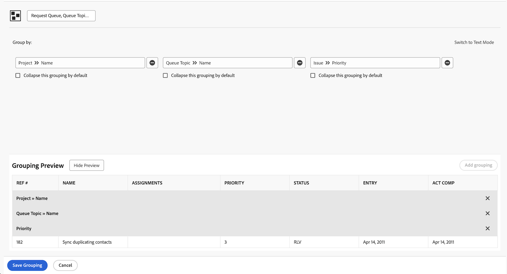

# Atividade: criar um agrupamento básico

Crie um agrupamento de problemas que será usado em um relatório para rastrear solicitações que passam por uma fila de solicitações. Esse agrupamento facilitará a visualização de tipos semelhantes de problemas/solicitações agrupados por prioridade. Nomeie o agrupamento &quot;Fila de solicitação, Tópico da fila, Prioridade&quot;.

Agrupe o relatório de problemas com base em:

1. O nome da fila de solicitações (este será o nome do projeto)
1. O tópico da fila
1. A prioridade da solicitação

## Responder

1. Em um relatório de lista de problemas, vá para o menu **[!UICONTROL Agrupamento]** e selecione **[!UICONTROL Novo agrupamento]**.
1. Nomeie seu agrupamento como &quot;Fila de solicitações, Tópico da fila, Prioridade&quot;.
1. Clique em **[!UICONTROL Adicionar agrupamento]**.
1. No campo [!UICONTROL Primeiro por]. digite &quot;nome do projeto&quot; e selecione **[!UICONTROL Nome]** na origem do campo Projeto.
1. Clique em **[!UICONTROL Adicionar outro agrupamento]**.
1. No campo [!UICONTROL E depois por], digite &quot;fila&quot; e selecione **[!UICONTROL Nome]** na origem do campo [!UICONTROL Tópico da fila].
1. Clique em **[!UICONTROL Adicionar outro agrupamento]**.
1. No campo [!UICONTROL E depois por], digite &quot;prioridade&quot; e selecione **[!UICONTROL Prioridade]** na origem do campo [!UICONTROL Problema].
1. Clique em **[!UICONTROL Salvar agrupamento]**
