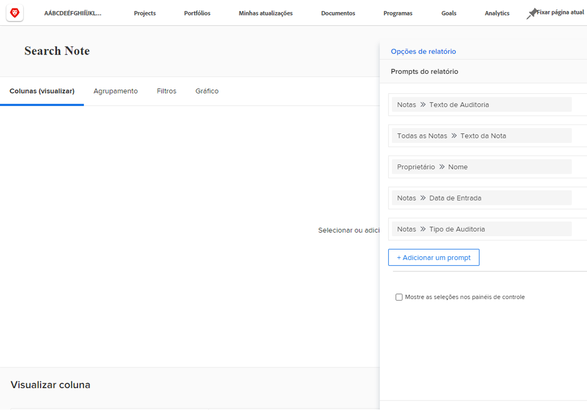
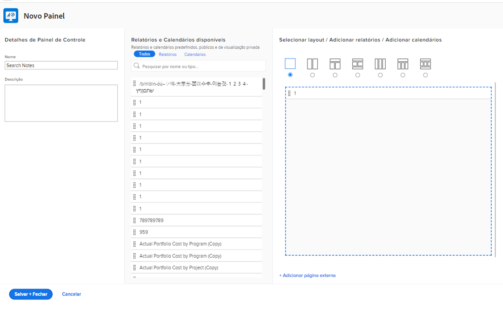
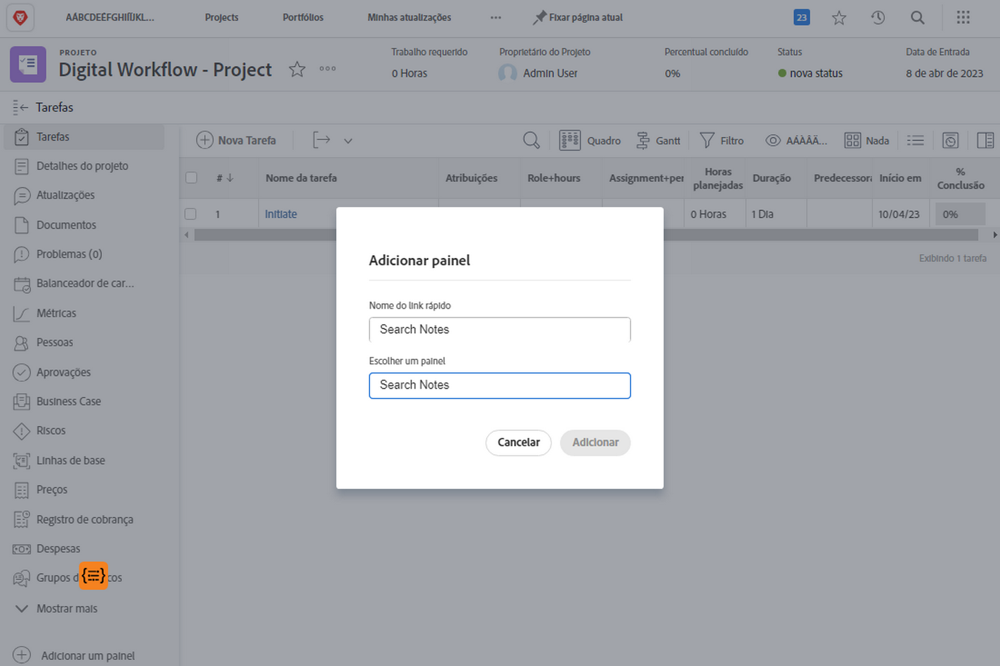

# Criar painéis

Neste vídeo, você aprenderá:

* O que é um painel no Workfront
* Como criar um painel
* Como localizar e usar painéis
* Como compartilhar um painel com outros usuários do Workfront
* Como imprimir um painel

>[!VIDEO](https://video.tv.adobe.com/v/335157/?quality=12&learn=on)

## Criar atividades do painel

[Clique aqui](/help/assets/create-dashboard-activities.pdf) para baixar um PDF desta página.

## Atividade 1: criar um painel

Crie um [!UICONTROL painel] com apenas um relatório nele—&quot;Procurar Notas neste Projeto.&quot; Isto é útil para encontrar rapidamente qualquer atualização feita em um projeto, mesmo que haja milhares de atualizações para pesquisar. Isso pesquisará as threads de atualização para extrair rapidamente quaisquer atualizações que atendam aos critérios especificados nos prompts.

Crie este relatório fazendo uma cópia do relatório &quot;Notas de pesquisa&quot; criado na atividade &quot;Criar um relatório de notas&quot; (ou use outro relatório se não tiver feito essa atividade).

* Remova o prompt Nome do projeto da cópia e renomeie o relatório &quot;Notas de pesquisa neste projeto&quot;.
* Nomeie o [!UICONTROL Painel] como &quot;Notas de Pesquisa&quot;.
* Vá para a página inicial de qualquer projeto e crie uma seção personalizada para um [!UICONTROL painel].
* Observe que quando você pesquisa por notas na seção personalizada, somente as notas contidas no projeto em que você está no momento serão exibidas.

## Resposta 1

1. Execute o relatório criado na atividade &quot;Criar um relatório de observações&quot;.
1. Clique em **[!UICONTROL Ações do relatório]** e selecione **[!UICONTROL Copiar]**. [!DNL Workfront] cria um novo relatório chamado &quot;Pesquisa de Nota (Cópia)&quot;.
1. Vá para **[!UICONTROL Ações de relatório]** e clique em **[!UICONTROL Editar]**. Clique em **[!UICONTROL Configurações do Relatório]** e altere o nome para &quot;Pesquisar Notas neste Projeto&quot;.
1. Clique em [!UICONTROL Solicitações de relatório] e exclua a solicitação [!UICONTROL Projeto] > [!UICONTROL Nome] da lista.

   

1. Marque a caixa **[!UICONTROL Mostrar solicitações no painel]**.
1. Clique em **[!UICONTROL Concluído]** e em **[!UICONTROL Salvar + Fechar]**. Você agora está olhando para a tela [!UICONTROL Solicitações] do relatório.

   Em seguida, você usará um atalho para criar um novo painel e adicionar este relatório a ele.

1. Clique em **[!UICONTROL Ações do relatório]** e selecione **[!UICONTROL Adicionar ao painel]** > **[!UICONTROL Novo painel]**.
1. Arraste o relatório &quot;Pesquisar anotações neste projeto&quot; para o painel **[!UICONTROL Layout]**.
1. Observe que o nome do relatório se torna o nome do painel. Edite o nome apenas para &quot;Pesquisar notas&quot;.

   

1. Clique em **[!UICONTROL Salvar + Fechar]**.

   Agora, adicione o painel a uma página do projeto.

   

1. Abra qualquer projeto. No menu do painel esquerdo, clique no ícone **[!UICONTROL Adicionar seção personalizada]**.
1. No campo **[!UICONTROL Adicionar um Painel]**, digite &quot;Notas de Pesquisa&quot; e selecione o [!UICONTROL painel] da lista.
1. No campo **[!UICONTROL Título da seção personalizada]**, digite &quot;Notas de pesquisa&quot;.
1. Clique em **[!UICONTROL Adicionar nova seção]**.
1. No menu do painel esquerdo, encontre “Notas de pesquisa”. Clique nos pontos à esquerda do nome da seção e arraste-a para a direita, abaixo de “Atualizações”.
