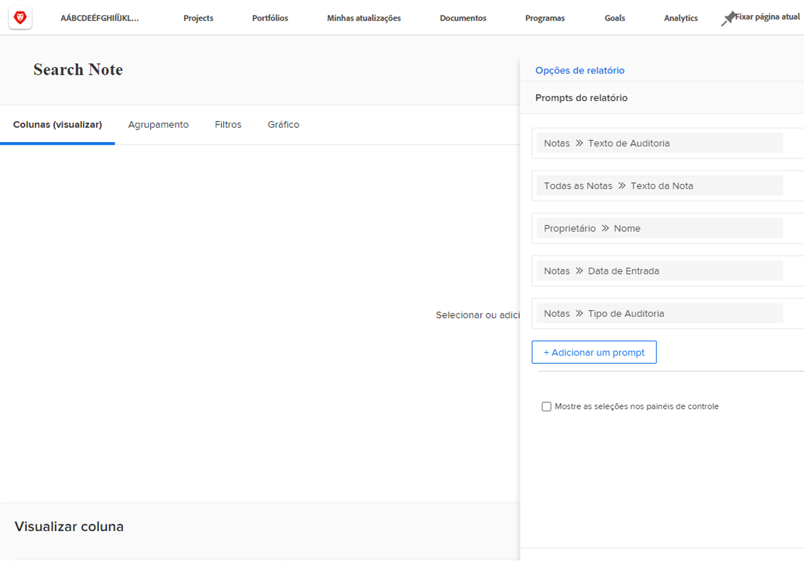
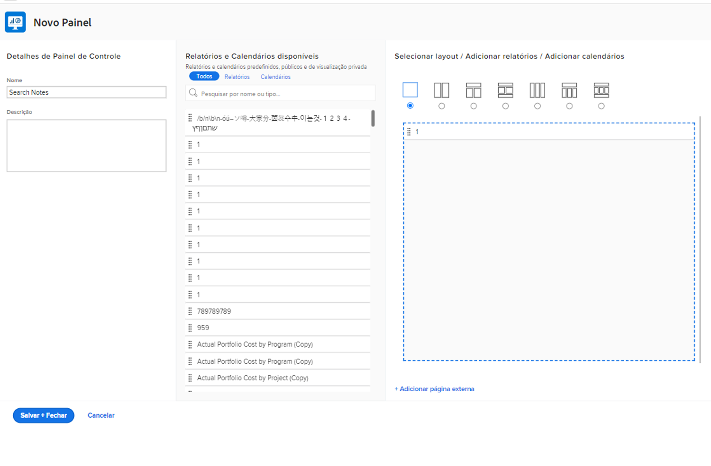
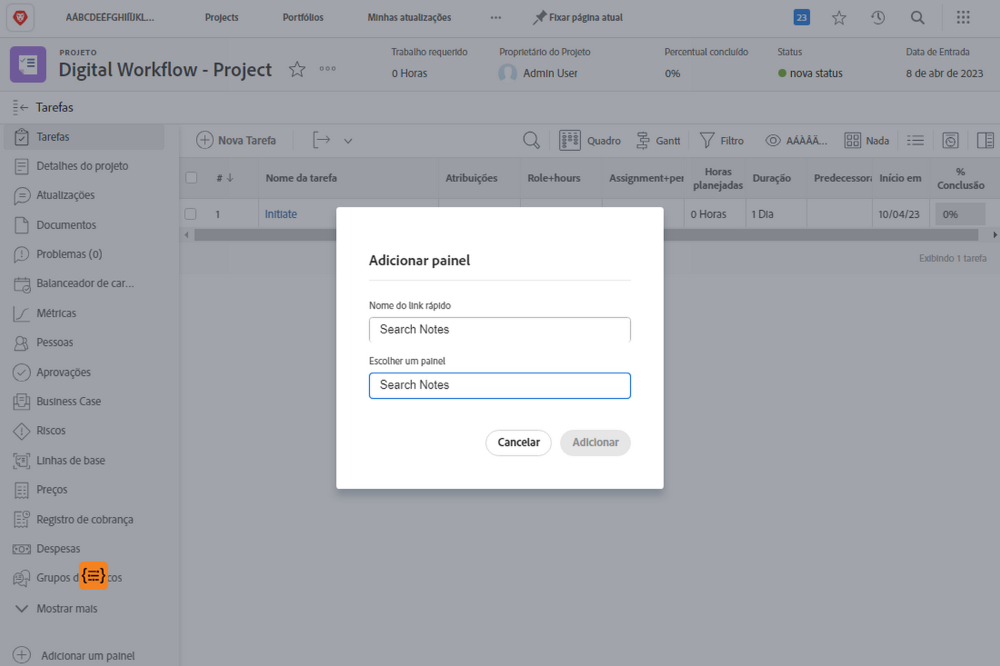

# Criar painéis no Workfront

O vídeo fornece um guia abrangente para entender e usar painéis no Workfront.
&#x200B;Ele explica que um painel é uma coleção de relatórios que permite aos usuários organizar e exibir dados relacionados em um local.

>[!VIDEO](https://video.tv.adobe.com/v/335157/?quality=12&learn=on&enablevpops=0)

## Principais lições

* **Painéis no Workfront:** um painel é uma coleção de relatórios que permite que os usuários organizem e exibam dados relacionados, como projetos, tarefas e problemas, em um modo de exibição centralizado. &#x200B;
* **Criação de Painéis:** os Painéis podem ser personalizados selecionando um layout, adicionando relatórios, calendários personalizados ou páginas externas e organizando-os para exibição ideal. &#x200B; Usuários também podem personalizar quais colunas aparecem em relatórios lado a lado no painel. &#x200B;
* **Acessando Painéis:** Painéis podem ser encontrados em &quot;Meus Painéis&quot;, &quot;Painéis Compartilhados&quot; ou &quot;Todos os Painéis&quot; na área Painéis. &#x200B; Painéis usados com frequência podem ser fixados ou adicionados aos favoritos para acesso rápido. &#x200B;
* **Painéis de Compartilhamento:** os painéis podem ser compartilhados com outros usuários do Workfront, incluindo todos os relatórios do painel, por meio do menu &quot;Ações do Painel&quot;. &#x200B;
* **Imprimindo Painéis:** Painéis podem ser impressos diretamente do menu &quot;Ações do Painel&quot;, facilitando o compartilhamento de cópias físicas dos dados. &#x200B;

## Atividades “Criar painel”

### Atividade 1: criar um painel

Crie um [!UICONTROL painel] com apenas um relatório: “Notas de pesquisa neste projeto”. Isto é útil para encontrar rapidamente qualquer atualização feita em um projeto, mesmo que haja milhares de atualizações para pesquisar. Isso pesquisará as threads de atualização para extrair rapidamente quaisquer atualizações que atendam aos critérios especificados nos prompts.

Crie este relatório fazendo uma cópia do relatório &quot;Search Notes&quot; que você criou na atividade &quot;Create a note report&quot;. Ainda não foi criado? Clique aqui para ver a atividade no tutorial [Criar um relatório de tarefa](https://experienceleague.adobe.com/en/docs/workfront-learn/tutorials-workfront/reporting/basic-reporting/create-a-task-report#activity-1-create-a-note-report-with-prompts).

* Remova a solicitação de nome do projeto da cópia e renomeie o relatório como “Notas de pesquisa neste projeto”.
* Nomeie o [!UICONTROL Painel] como “Notas de pesquisa”.
* Vá para a página de destino de qualquer projeto e crie uma seção personalizada para um [!UICONTROL painel].
* Observe que ao pesquisar por notas na seção personalizada, somente as notas contidas no projeto que você está acessando serão exibidas.

### Resposta 1

1. Execute o relatório criado na atividade &quot;Criar um relatório de observações&quot;. Ainda não foi criado? Clique aqui para ver a atividade no tutorial [Criar um relatório de tarefa](https://experienceleague.adobe.com/en/docs/workfront-learn/tutorials-workfront/reporting/basic-reporting/create-a-task-report#activity-1-create-a-note-report-with-prompts).
1. Clique em **[!UICONTROL Ações do relatório]** e selecione **[!UICONTROL Copiar]**. O [!DNL Workfront] cria um novo relatório chamado “Pesquisa de notas (cópia)”.
1. Vá para **[!UICONTROL Ações de relatório]** e clique em **[!UICONTROL Editar]**. Clique em **[!UICONTROL Configurações de relatório]** e altere o nome para “Notas de pesquisa neste projeto”.
1. Clique em [!UICONTROL Solicitações de relatório] e exclua a solicitação [!UICONTROL Projeto] > [!UICONTROL Nome] da lista.

   

1. Marque a caixa **[!UICONTROL Mostrar solicitações no painel]**.
1. Clique em **[!UICONTROL Concluído]** e em **[!UICONTROL Salvar + Fechar]**. Você agora está olhando para a tela [!UICONTROL Solicitações] do relatório.

   Em seguida, você usará um atalho para criar um novo painel e adicionar este relatório a ele.

1. Clique em **[!UICONTROL Ações de Relatório]** e selecione **[!UICONTROL Adicionar ao Painel Clássico]** > **[!UICONTROL Novo Painel]**.
1. Arraste o relatório “Notas de pesquisa neste projeto” para o painel **[!UICONTROL Layout]**.
1. Observe que o nome do relatório se torna o nome do painel. Altere o nome para “Notas de pesquisa”.

   

1. Clique em **[!UICONTROL Salvar + Fechar]**.

   Agora, adicione o painel a uma página do projeto.

   

1. Abra qualquer projeto. No menu do painel esquerdo, clique no botão **[!UICONTROL Adicionar um painel]**.
1. No campo **[!UICONTROL Escolher um painel]**, digite &quot;Notas de Pesquisa&quot; e selecione o [!UICONTROL painel] na lista.
1. No campo **[!UICONTROL Nome do link rápido]**, digite &quot;Notas de Pesquisa&quot;.
1. Clique em **[!UICONTROL Adicionar]**.
1. No menu do painel esquerdo, localize as Notas de pesquisa perto da parte inferior. Clique nos pontos à esquerda do nome e arraste-o para a direita abaixo de Atualizações.
