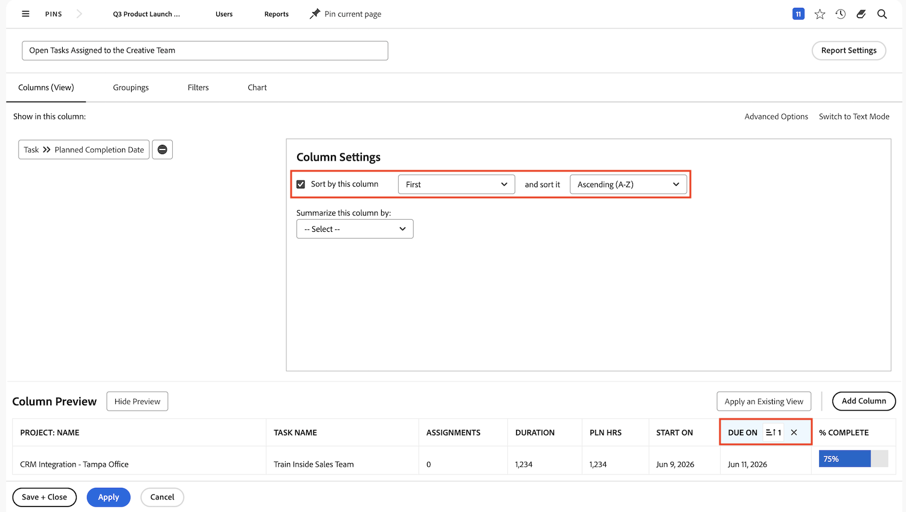
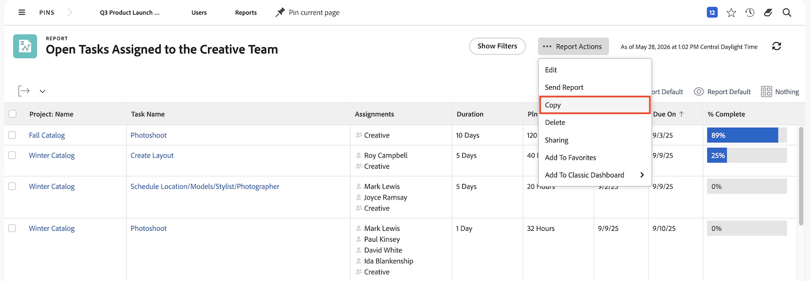
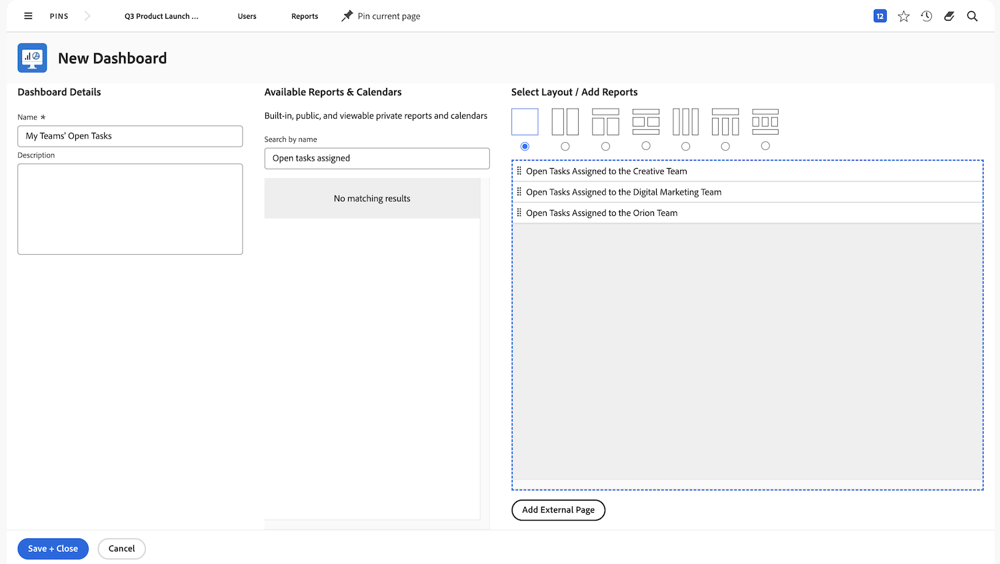
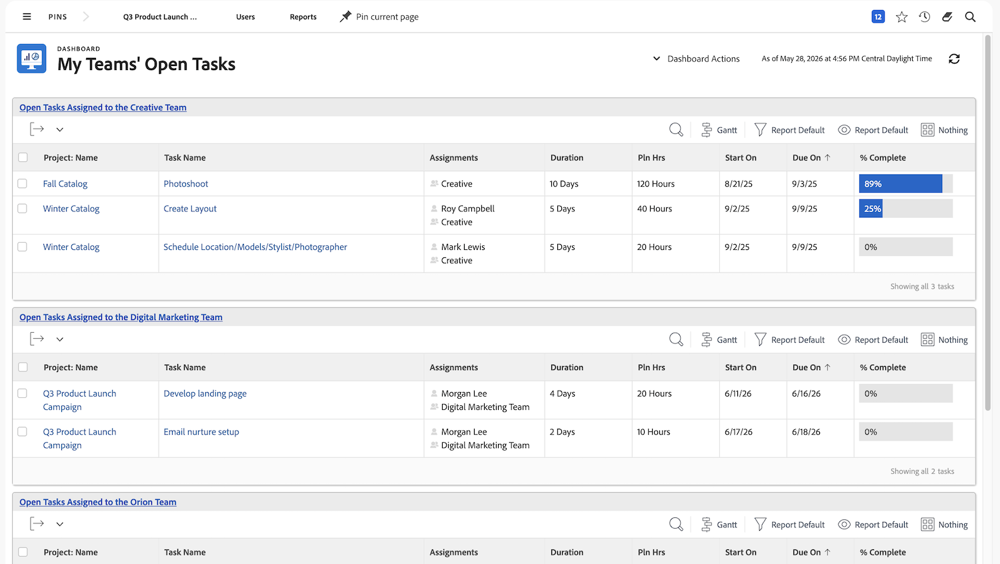

# Criar painéis no Workfront

O vídeo fornece um guia abrangente para entender e usar painéis no Workfront.
&#x200B;Ele explica que um painel é uma coleção de relatórios que permite aos usuários organizar e exibir dados relacionados em um local.

>[!VIDEO](https://video.tv.adobe.com/v/335157/?quality=12&learn=on&enablevpops=0)

## Principais conclusões

* **Painéis no Workfront:** um painel é uma coleção de relatórios que permite que os usuários organizem e exibam dados relacionados, como projetos, tarefas e problemas, em um modo de exibição centralizado. &#x200B;
* **Criação de Painéis:** os Painéis podem ser personalizados selecionando um layout, adicionando relatórios, calendários personalizados ou páginas externas e organizando-os para exibição ideal. &#x200B; Usuários também podem personalizar quais colunas aparecem em relatórios lado a lado no painel. &#x200B;
* **Acessando Painéis:** Painéis podem ser encontrados em &quot;Meus Painéis&quot;, &quot;Painéis Compartilhados&quot; ou &quot;Todos os Painéis&quot; na área Painéis. &#x200B; Painéis usados com frequência podem ser fixados ou adicionados aos favoritos para acesso rápido. &#x200B;
* **Painéis de Compartilhamento:** os painéis podem ser compartilhados com outros usuários do Workfront, incluindo todos os relatórios do painel, por meio do menu &quot;Ações do Painel&quot;. &#x200B;
* **Imprimindo Painéis:** Painéis podem ser impressos diretamente do menu &quot;Ações do Painel&quot;, facilitando o compartilhamento de cópias físicas dos dados. &#x200B;

## Atividades “Criar painel”

### Atividade 1: criar um painel

Crie um [!UICONTROL painel] com apenas um relatório: “Notas de pesquisa neste projeto”. Isto é útil para encontrar rapidamente qualquer atualização feita em um projeto, mesmo que haja milhares de atualizações para pesquisar. Isso pesquisará as threads de atualização para extrair rapidamente quaisquer atualizações que atendam aos critérios especificados nos prompts.

Crie este relatório fazendo uma cópia do relatório &quot;Search Notes&quot; que você criou na atividade &quot;Create a note report&quot;. Ainda não foi criado? Clique aqui para ver a atividade no tutorial [Criar um relatório de tarefa](https://experienceleague.adobe.com/en/docs/workfront-learn/tutorials-workfront/reporting/basic-reporting/create-a-task-report#activity-1-create-a-note-report-with-prompts).

* Remova a solicitação de nome do projeto da cópia e renomeie o relatório como “Notas de pesquisa neste projeto”.
* Nomeie o [!UICONTROL Painel] como “Notas de pesquisa”.
* Vá para a página de destino de qualquer projeto e crie uma seção personalizada para um [!UICONTROL painel].
* Observe que ao pesquisar por notas na seção personalizada, somente as notas contidas no projeto que você está acessando serão exibidas.

### Resposta 1

1. Execute o relatório criado na atividade &quot;Criar um relatório de observações&quot;. Ainda não foi criado? Clique aqui para ver a atividade no tutorial [Criar um relatório de tarefa](https://experienceleague.adobe.com/en/docs/workfront-learn/tutorials-workfront/reporting/basic-reporting/create-a-task-report#activity-1-create-a-note-report-with-prompts).
1. Clique em **[!UICONTROL Ações do relatório]** e selecione **[!UICONTROL Copiar]**. O [!DNL Workfront] cria um novo relatório chamado “Pesquisa de notas (cópia)”.
1. Vá para **[!UICONTROL Ações de relatório]** e clique em **[!UICONTROL Editar]**. Clique em **[!UICONTROL Configurações de relatório]** e altere o nome para “Notas de pesquisa neste projeto”.
1. Clique em [!UICONTROL Solicitações de relatório] e exclua a solicitação [!UICONTROL Projeto] > [!UICONTROL Nome] da lista.

   

1. Marque a caixa **[!UICONTROL Mostrar solicitações no painel]**.
1. Clique em **[!UICONTROL Concluído]** e em **[!UICONTROL Salvar + Fechar]**. Você agora está olhando para a tela [!UICONTROL Solicitações] do relatório.

   Em seguida, você usará um atalho para criar um novo painel e adicionar este relatório a ele.

1. Clique em **[!UICONTROL Ações de Relatório]** e selecione **[!UICONTROL Adicionar ao Painel Clássico]** > **[!UICONTROL Novo Painel]**.
1. Arraste o relatório “Notas de pesquisa neste projeto” para o painel **[!UICONTROL Layout]**.
1. Observe que o nome do relatório se torna o nome do painel. Altere o nome para “Notas de pesquisa”.

   

1. Clique em **[!UICONTROL Salvar + Fechar]**.

   Agora, adicione o painel a uma página do projeto.

   

1. Abra qualquer projeto. No menu do painel esquerdo, clique no botão **[!UICONTROL Adicionar um painel]**.
1. No campo **[!UICONTROL Escolher um painel]**, digite &quot;Notas de Pesquisa&quot; e selecione o [!UICONTROL painel] na lista.
1. No campo **[!UICONTROL Nome do link rápido]**, digite &quot;Notas de Pesquisa&quot;.
1. Clique em **[!UICONTROL Adicionar]**.
1. No menu do painel esquerdo, localize as Notas de pesquisa perto da parte inferior. Clique nos pontos à esquerda do nome e arraste-o para a direita abaixo de Atualizações.

### Atividade 2: tarefas abertas de minhas equipes

Crie um [!UICONTROL painel] com três relatórios de &quot;tarefa aberta&quot;, cada um filtrado por uma equipe diferente atribuída às tarefas.

Use um relatório de &quot;tarefa aberta&quot; existente, filtrado por uma equipe, se você tiver um, ou crie um novo para esse painel. Copie e edite o relatório duas vezes para duas equipes adicionais, em seguida, coloque-as em um único painel chamado **&quot;Tarefas Abertas de Minhas Equipes.&quot;**

### Resposta 2

#### Parte 1 — criar um relatório de &quot;tarefas abertas&quot; filtrado por uma de suas equipes

1. Selecione **[!UICONTROL Relatórios]** no **[!UICONTROL Menu principal]**.
1. Clique no menu **[!UICONTROL Novo Relatório]** e selecione **[!UICONTROL Tarefa]**.
1. Nomeie seu relatório &quot;Tarefas abertas atribuídas à equipe da Creative&quot; (ou a qualquer outra equipe).
1. Em **[!UICONTROL Colunas (Visualização)]** configure as colunas para incluir:

   

   * [!UICONTROL Projeto] > [!UICONTROL Nome]
   * [!UICONTROL Tarefa] > [!UICONTROL Nome]
   * [!UICONTROL Tarefa] > [!UICONTROL Atribuições]
   * [!UICONTROL Tarefa] > [!UICONTROL Duração]
   * [!UICONTROL Tarefa] > [!UICONTROL Horas planejadas]
   * [!UICONTROL Tarefa] > [!UICONTROL Data de Início Planejada]
   * [!UICONTROL Tarefa] > [!UICONTROL Data de Término Planejada]
   * [!UICONTROL Tarefa] > [!UICONTROL Percentual Concluído]

1. Selecione a coluna **[!UICONTROL Data de conclusão planejada]** e altere a Classificação para **Crescente**.

1. Na guia **[!UICONTROL Filtros]**, adicione regras de filtro para incluir:

   

   * [!UICONTROL Projeto] > [!UICONTROL Status Equivale A ] > [!UICONTROL Igual] > &quot;Atual&quot;
   * [!UICONTROL Tarefa] > [!UICONTROL ID da Equipe] > [!UICONTROL Igual] > &quot;Creative&quot;
   * [!UICONTROL Tarefa] > [!UICONTROL Percentual Concluído] > [!UICONTROL Menor Que] > &quot;100&quot;

1. Clique no botão **[!UICONTROL Salvar+Fechar]** para salvar e fechar seu relatório.

#### Parte 2 - Copie o relatório que acabou de criar e crie um novo relatório para sua segunda equipe

1. Exibindo o relatório que acabou de criar, clique em **[!UICONTROL Ações de Relatório] > [!UICONTROL Copiar]**.
1. O novo relatório aparecerá com o nome **&quot;(Cópia)&quot;** anexado no título.
1. Clique em **[!UICONTROL Ações de Relatório] > [!UICONTROL Editar]**. Em seguida, altere o filtro e o título do relatório para se concentrar na equipe Orion (ou em qualquer outra equipe).
1. Clique na guia [!UICONTROL Filtros] e altere a regra de filtro
   **[!UICONTROL Tarefa] > [!UICONTROL ID da Equipe] > [!UICONTROL Igual] > &quot;Creative&quot;** para
   **[!UICONTROL Tarefa] > [!UICONTROL ID da Equipe] > [!UICONTROL Igual] > &quot;Orion&quot;**
1. No campo Título do Relatório, altere a palavra **[!UICONTROL &quot;Creative&quot;]** para **[!UICONTROL &quot;Orion&quot;]** e exclua a palavra **&quot;(Cópia)&quot;**.
1. Clique no botão **[!UICONTROL Salvar+Fechar]** para salvar e fechar seu relatório.

#### Parte 3 - Copie o relatório novamente e crie um novo relatório para sua terceira equipe

1. Exibindo o relatório que acabou de criar, clique novamente em **[!UICONTROL Ações de Relatório] > [!UICONTROL Copiar]**. Dessa vez, altere o nome da equipe no título e o filtro para &quot;Marketing digital&quot; (ou qualquer outra equipe).

#### Parte 4 - Criar um painel mostrando as tarefas abertas em cada uma de suas equipes

1. No menu principal, clique em **[!UICONTROL Painéis]**.
1. Clique em **[!UICONTROL Novo Painel]**.

   

1. Nomeie o painel **como &quot;Tarefas Abertas de Minhas Equipes&quot;**.
1. Comece digitando o nome de seus relatórios no campo **[!UICONTROL Pesquisar por nome]**.
1. Como os nomes dos relatórios começam com as mesmas palavras, você pode vê-los todos aparecendo assim:

   

1. Arraste-os para a área de layout e clique em Salvar + Fechar.

   

1. Aqui está o painel final:

   
