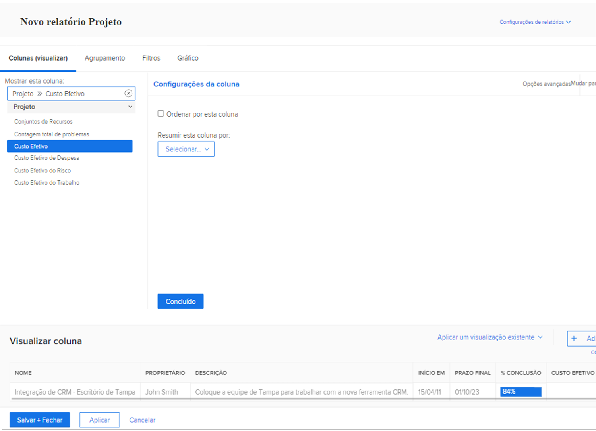
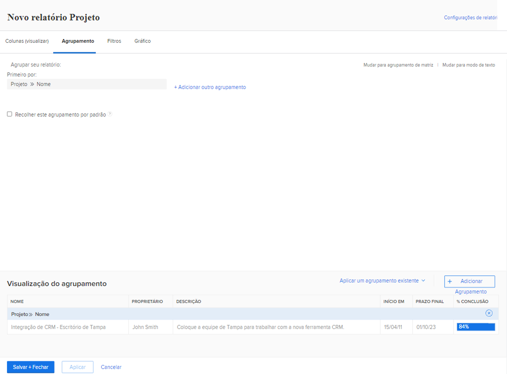
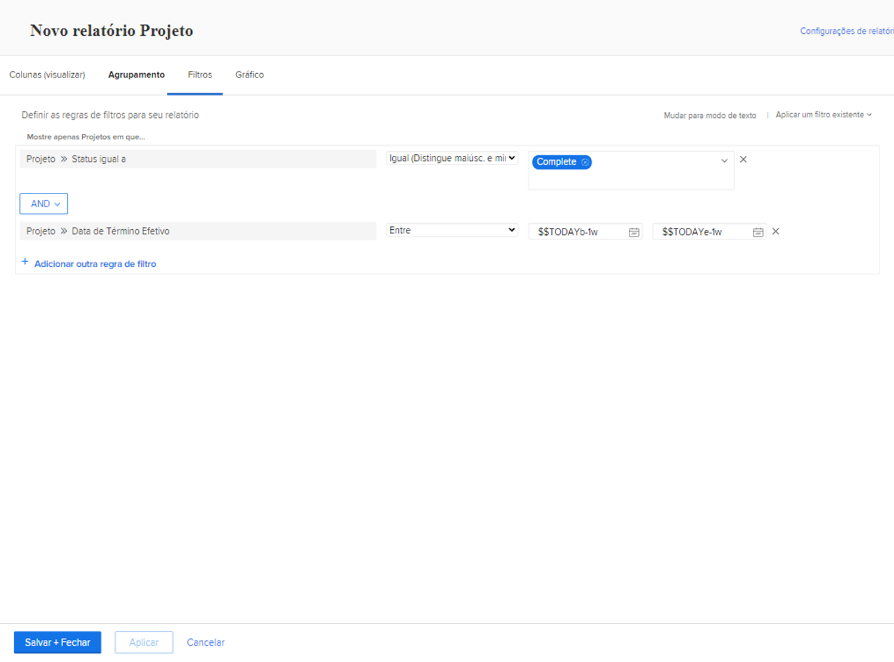

# Criar relatórios com gráficos

Neste vídeo, você aprenderá:

* Como os gráficos podem melhorar a visualização de dados
* Como usar as ferramentas de gráfico do Workfront

>[!VIDEO](https://video.tv.adobe.com/v/335155/?quality=12&learn=on)

## Atividades de criação de relatórios com gráficos

[Clique aqui](/help/assets/create-reports-with-charts-activities.pdf) para baixar um PDF desta página.

### Atividade 1: adicionar um gráfico a um relatório

O final do trimestre está se aproximando e você talvez queira ver como os projetos concluídos recentemente cumpriram seus orçamentos. Crie um relatório que mostre o custo planejado em relação ao custo efetivo dos projetos. Consulte apenas os projetos que foram concluídos no último trimestre. Adicione um gráfico de colunas de combinação usando cores personalizadas.

### Resposta 1

1. Selecione **[!UICONTROL Relatórios]** no **[!UICONTROL Menu principal]**.
1. Clique no menu **[!UICONTROL Novo relatório]** e selecione **[!UICONTROL Projeto]**.
1. Na guia **[!UICONTROL Colunas (visualização)]**, clique em **[!UICONTROL Adicionar coluna]**.
1. Selecione [!UICONTROL Projeto] > [!UICONTROL Custo planejado] e resuma esta coluna pela **[!UICONTROL Soma]**.
1. Clique em **[!UICONTROL Adicionar coluna]** novamente.
1. Selecione [!UICONTROL Projeto] > [!UICONTROL Custo efetivo] e resuma esta coluna pela **[!UICONTROL Soma]**.

   

1. Na guia **[!UICONTROL Agrupamentos]**, agrupe o relatório por [!UICONTROL Projeto] > [!UICONTROL Nome].

   

1. Na guia **[!UICONTROL Filtros]**, adicione duas regras de filtro:

   * [!UICONTROL Projeto] > [!UICONTROL Status igual a] > [!UICONTROL Concluído]
   * [!UICONTROL Projeto] > [!UICONTROL  Data efetiva de conclusão] > [!UICONTROL Último trimestre]

   

1. Na guia **[!UICONTROL Gráfico]**, escolha **[!UICONTROL Coluna]** como o tipo de gráfico.
1. Para o [!UICONTROL Eixo esquerdo (Y)], escolha [!UICONTROL Projeto] > [!UICONTROL Custo planejado].
1. Para o [!UICONTROL Eixo inferior (X)], escolha [!UICONTROL Projeto] > [!UICONTROL Nome].
1. Clique no botão **[!UICONTROL Gráfico de combinação]** e selecione [!UICONTROL Projeto] > [!UICONTROL Custo efetivo] no campo **[!UICONTROL Valor]**.
1. Clique na seta ao lado da caixa de cores para alterar a cor do [!UICONTROL Custo efetivo]. Selecione uma das cores que aparece ou clique na caixa no canto inferior direito para abrir a paleta de cores.
1. Clique em **[!UICONTROL Salvar + Fechar]**. Quando for solicitado um nome de relatório, insira “Custo planejado comparado ao custo efetivo de projetos concluídos no último trimestre”.

   
