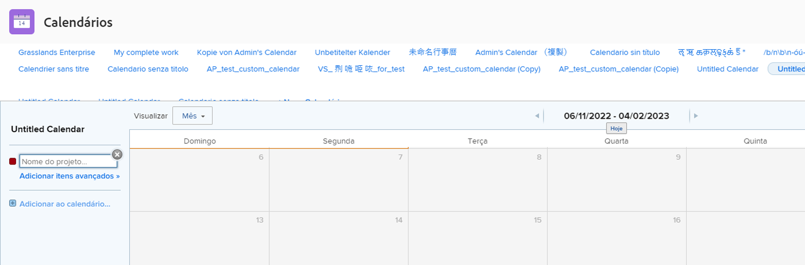
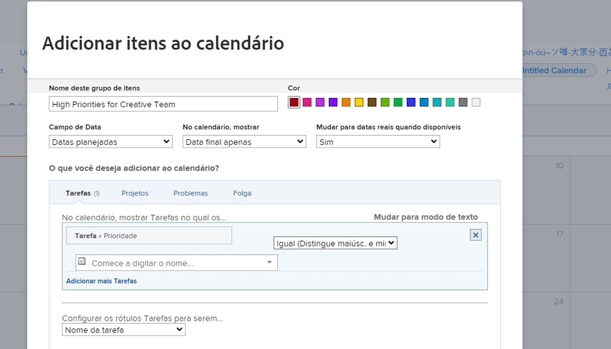
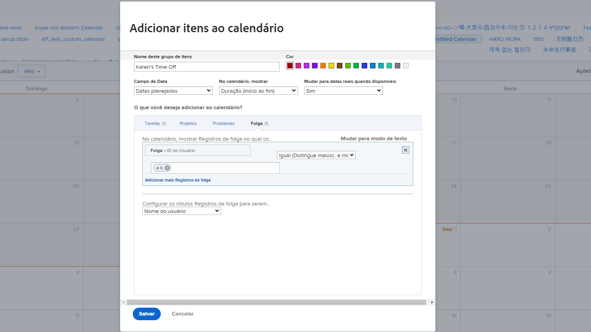

# Criar um calendário personalizado

Nesta seção, você aprenderá a:

* Criar um novo calendário
* Criar um agrupamento de calendário
* Adicionar itens de trabalho ao agrupamento de calendário
* Criar um horário de calendário

Veja como criar seu próprio calendário personalizado.

## Primeiro, adicione um novo calendário

1. No **[!UICONTROL Menu principal]**, selecione o **[!UICONTROL Calendários]** área.
1. Clique no botão **[!UICONTROL Novo calendário]** opção.
1. Digite um nome para o calendário e pressione **[!UICONTROL Retorno]**.

## Segundo, adicionar um agrupamento de calendário

1. Para exibir itens relacionados a um projeto específico, insira o nome do projeto no [!UICONTROL agrupamento] (exibe todas as tarefas relacionadas a esse projeto).
1. Ou clique no botão **[!UICONTROL Adicionar itens avançados]** opção para incluir itens de trabalho de uma variedade de projetos no sistema.

## Terceiro, adicione itens de trabalho ao agrupamento de calendário

1. Nomeie o agrupamento para refletir o que será exibido.
1. Selecione uma designação de cor para o grupo.
1. Selecione o tipo de data a ser usado—[!UICONTROL Datas previstas], [!UICONTROL Datas previstas]ou [!UICONTROL Personalizado]. ([!UICONTROL Personalizado] datas são campos de data incluídos em [!UICONTROL formulários personalizados].)
1. Selecione as datas que devem ser mostradas no calendário—[!UICONTROL Somente Data Final], [!UICONTROL Somente Data Inicial]ou [!UICONTROL Duração (início ao fim)].
1. Se desejar exibir [!UICONTROL Datas reais] quando essa informação estiver disponível, selecione Yes (Sim) no menu. Selecione Não se desejar sempre o tipo de data selecionado ([!UICONTROL Projetado], [!UICONTROL Planejado]ou [!UICONTROL Personalizado]) para exibir.
1. Selecione o tipo de informação de item que pretende ver no calendário—[!UICONTROL Tarefas], [!UICONTROL Projetos], [!UICONTROL Problemas]ou [!UICONTROL Hora de desligar].
1. Configure os filtros para mostrar as informações desejadas.
1. Clique em **[!UICONTROL Salvar]**.

>[!NOTE]
>
>Agrupamentos adicionais podem ser adicionados a um calendário existente usando a opção Adicionar ao calendário .

## Criar um calendário mostrando a folga pessoal

[!DNL Workfront] O fornece uma maneira de especificar seu tempo de folga com o recurso de tempo de folga pessoal no perfil do usuário. Isso alerta os gerentes de projeto que não estão disponíveis e permite que as datas de conclusão planejadas sejam ajustadas automática ou manualmente, conforme necessário.

Na área Calendário , é possível criar uma exibição de calendário mostrando essas entradas de tempo.

Para criar um calendário para uma determinada pessoa:

1. Clique em **[!UICONTROL Adicionar ao Calendário]** no painel esquerdo.
1. Clique em **[!UICONTROL Adicionar itens avançados]**.
1. Nomeie o agrupamento para refletir o que será exibido.
1. Selecione uma designação de cor para o agrupamento.
1. Defina as [!UICONTROL Campo de data] para [!UICONTROL Datas previstas].
1. Selecione as datas que devem ser mostradas no calendário—[!UICONTROL Duração].
1. Ignore como as informações serão exibidas se as datas reais não estiverem disponíveis. Isso não se aplica.
1. Selecionar [!UICONTROL Hora de desligar] para o tipo de informação que deseja visualizar.
1. Para o filtro, defina a ID do usuário como o nome do membro da equipe.
1. Clique em **[!UICONTROL Salvar]**.

