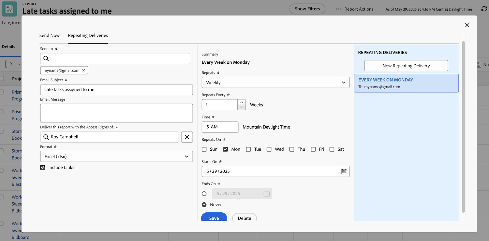

# Envie e compartilhe relatórios

Neste vídeo, você aprenderá:

* Como enviar relatórios para usuários, equipes ou qualquer endereço de email
* Como compartilhar relatórios com qualquer pessoa
* O que os destinatários podem ver e fazer com um relatório do Workfront

>[!VIDEO](https://video.tv.adobe.com/v/335158/?quality=12&learn=on)

## Atividades de enviar e compartilhar relatórios

[Clique aqui](/help/assets/send-and-share-reports-activities.pdf) para baixar um PDF desta página.

### Atividade 1: enviar um relatório

Envie um relatório para você mesmo todas as segundas-feiras às 5h em forma de uma planilha Excel. Essa é uma ótima maneira de coletar automaticamente relatórios semanais que você pode posteriormente usar para visualizar tendências.

### Resposta 1

1. Visualize qualquer relatório que você criou e escolha **[!UICONTROL Enviar relatório]** no menu **[!UICONTROL Ações do relatório]**.
1. Clique na guia **[!UICONTROL Entregas repetidas]**.
1. Coloque seu endereço de email no campo **[!UICONTROL Enviar para]**.
1. Forneça um assunto para o email.
1. Altere o formato para Excel.
1. Defina **[!UICONTROL Repete]** como [!UICONTROL Semanalmente].
1. Defina o [!UICONTROL Horário] como 5h.
1. Defina [!UICONTROL Repete em] como segunda-feira.
1. Clique em **[!UICONTROL Salvar]**.

>[!NOTE]
>
>Observe sua nova entrega repetida no painel [!UICONTROL Entregas repetidas] à direita. Você pode configurar várias entregas para um relatório e todas elas aparecerão aqui.

**EXCLUA UMA ENTREGA**

Selecione a entrega que você acabou de criar e clique em Excluir (ao lado do botão **[!UICONTROL Salvar]**).
