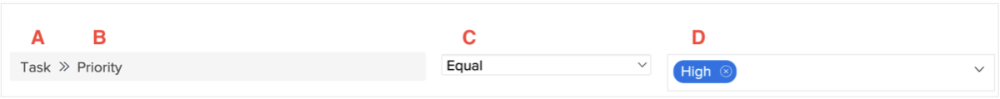

# Explorar componentes de relatórios no Workfront

O vídeo explica o conceito de componentes de relatórios no Workfront, que são essenciais para criar filtros, visualizações e agrupamentos. Os principais componentes incluem:

* **Tipo de Objeto:** Especifica o objeto do Workfront que está sendo tratado, como uma entrada de projeto, tarefa ou hora. &#x200B; Filtros, visualizações e agrupamentos são específicos para o tipo de objeto. &#x200B;
* **Source de Campo e Nome de Campo:** A origem do campo é o item no Workfront onde as informações estão anexadas, e o nome do campo é a parte específica das informações (por exemplo, &quot;descrição&quot; de um projeto). &#x200B;
* **Campo de Valor:** representa o conteúdo de um campo, como &quot;baixo&quot;, &quot;normal&quot;, &quot;alto&quot; ou &quot;urgente&quot; para o campo de prioridade. &#x200B;
* **Qualificador de Filtro:** Define quais valores incluir ou excluir em um relatório, como mostrar tarefas com prioridade &quot;alta&quot;. &#x200B;

>[!VIDEO](https://video.tv.adobe.com/v/335146/?quality=12&learn=on&enablevpops=0)

## Principais lições

* **Componentes de relatório:** os componentes de relatório do Workfront incluem tipo de objeto, origem de campo, nome de campo, qualificadores de filtro e campo de valor, que são essenciais para a criação de filtros, exibições e agrupamentos. &#x200B;
* **Especificidade do Tipo de Objeto:** Filtros, exibições e agrupamentos estão ligados a tipos de objeto específicos, como projetos, tarefas ou entradas de horas, garantindo que os relatórios sejam ajustados aos dados relevantes. &#x200B;
* **Regras de Filtro:** Os filtros usam origem de campo, nome de campo, qualificadores e valores para definir critérios. &#x200B; Por exemplo, o filtro &quot;Meus projetos&quot; mostra somente os projetos atuais em que o usuário conectado faz parte da equipe do projeto. &#x200B;
* **Exibições e Agrupamentos:** as exibições exibem combinações de origem e nome de campo em colunas (por exemplo, &quot;nome do proprietário&quot;), enquanto os agrupamentos organizam dados com base em critérios específicos (por exemplo, &quot;nome da empresa&quot;). &#x200B;
* **Uso de curingas:** curingas em filtros permitem correspondência dinâmica, como identificar usuários conectados em uma equipe de projeto, aprimorando a personalização nos relatórios. &#x200B;

## Referência rápida dos componentes de relatórios

**A: origem do campo**

As opções de origem do campo dependem do tipo de objeto selecionado. Geralmente, a origem do campo é o item no Workfront ao qual pertence uma informação específica (também chamada de nome do campo). Às vezes, a origem do campo é igual ao tipo de objeto.
A origem do campo determina quais nomes de campos estão disponíveis.

Exemplos: [!UICONTROL Projeto], [!UICONTROL Tarefa], [!UICONTROL Problema], [!UICONTROL Atribuído a]

**B: nome do campo**

Nomes de campos são informações disponíveis sobre o item selecionado como origem do campo.

Eles podem ser campos do Workfront que você preencheu, campos de um formulário personalizado ou informações que o Workfront captura automaticamente.

Nomes de campos determinam as opções do campo de valor.

Exemplos: [!UICONTROL Status do progresso], [!UICONTROL Descrição], [!UICONTROL Data de conclusão planejada], Campos de formulário personalizados

**C: qualificadores de filtro**

Os qualificadores de filtro ajudam a restringir os possíveis resultados que podem ser vistos nos campos de origem e nome selecionados.

Eles especificam como a origem e nome do campo se relacionam com o campo de valor.

Exemplos: Igual, Contém, Nulo, Menor que

**D: valor**

O valor são as informações inseridas no campo especificado pelo nome do campo.

As opções de valor são determinadas pela origem e nome do campo.

É possível utilizar curingas como valor para usuários e datas, bem como um texto livre.

Exemplos: Novo, Atual, $$TODAYbw, Descrição

>[!TIP]
>
>Para entender mais sobre nomes de campo específicos do Workfront, consulte o [Glossário de terminologia do Adobe Workfront](https://experienceleague.adobe.com/docs/workfront/using/basics/workfront-terminology-glossary.html?lang=br).

