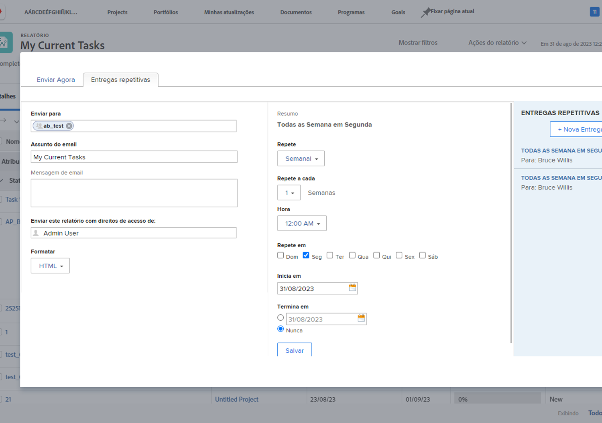

# Atividades de enviar e compartilhar relatórios

Pratique o envio e o compartilhamento de relatórios, com instruções passo a passo.

## Atividade 1: enviar um relatório

Envie um relatório para você mesmo todas as segundas-feiras às 5h em forma de uma planilha Excel. Essa é uma ótima maneira de coletar automaticamente relatórios semanais que você pode posteriormente usar para visualizar tendências.

## Resposta 1

1. Visualize qualquer relatório que você criou e escolha **[!UICONTROL Enviar relatório]** no menu **[!UICONTROL Ações do relatório]**.
1. Clique na guia **[!UICONTROL Entregas repetidas]**.
1. Coloque seu endereço de email no campo **[!UICONTROL Enviar para]**.
1. Forneça um assunto para o email.
1. Altere o formato para Excel.
1. Defina **[!UICONTROL Repete]** como [!UICONTROL Semanalmente].
1. Defina o [!UICONTROL Horário] como 5h.
1. Defina [!UICONTROL Repete em] como segunda-feira.
1. Clique em **[!UICONTROL Salvar]**.

>[!NOTE]
>
>Observe sua nova entrega repetida no painel [!UICONTROL Entregas repetidas] à direita. Você pode configurar várias entregas para um relatório e todas elas aparecerão aqui.

**EXCLUA UMA ENTREGA**

Selecione a entrega que você acabou de criar e clique em Excluir (ao lado do botão **[!UICONTROL Salvar]**).
