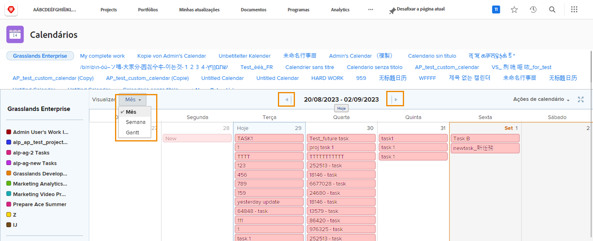

# Entender a interface do calendário

Nesta seção, você aprenderá sobre:

* Grupos de calendário
* Exibições de calendário
* Menu Ações do calendário
* E como criar um item de calendário ad-hoc

Antes de criar seus próprios calendários personalizados, vamos fazer um tour dos recursos básicos disponíveis em calendários personalizados.

## Grupos de calendário

Um único calendário pode ser organizado em agrupamentos distintos de itens de trabalho. Cada agrupamento pode ser ativado e desativado, permitindo que os usuários se concentrem nos itens de trabalho que mais importam a qualquer momento.

## Exibições de calendário

O calendário pode ser exibido em mês, semana ou [!UICONTROL Gantt] formato. Use a barra de rolagem lateral ou as setas na parte superior para se mover pelo calendário. O [!UICONTROL Gantt] permite que você veja seu trabalho de uma perspectiva diferente. Encontre a exibição que funciona melhor para você.

![Uma imagem da tela do calendário na [!UICONTROL Gantt] exibir](assets/calendar-1-1bb.png)

## [!UICONTROL Ações do calendário] menu

Assim como outros itens de trabalho, os calendários têm um [!UICONTROL Ações] , permitindo que você visualize os finais de semana em um calendário; excluir ou copiar um calendário; compartilhar um calendário com usuários individuais da Workfront, em todo o sistema ou com usuários externos; e adicionar o calendário ao seu [!UICONTROL Favoritos] menu.

![Uma imagem da [!UICONTROL Ações do calendário] tela](assets/calendar-1-1c.png)

## Modo de tela cheia

Exiba o calendário no modo de tela cheia clicando no ícone de tela cheia. Clique novamente em para retornar ao tamanho original.

## Informações resumidas

Selecione um item no calendário para exibir detalhes resumidos desse item, incluindo nome, projeto de origem, status, atribuição, status do progresso e data de vencimento.

## Eventos ad hoc

Clique duas vezes para criar eventos ad hoc em um calendário para representar sua programação ou outros itens de trabalho.

>[!NOTE]
>
>Criar um evento ad hoc NÃO cria uma tarefa no Workfront.

