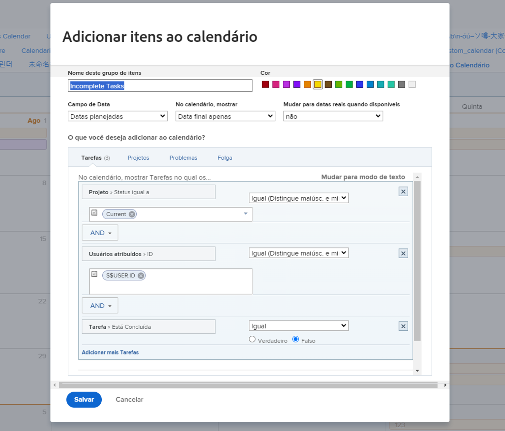
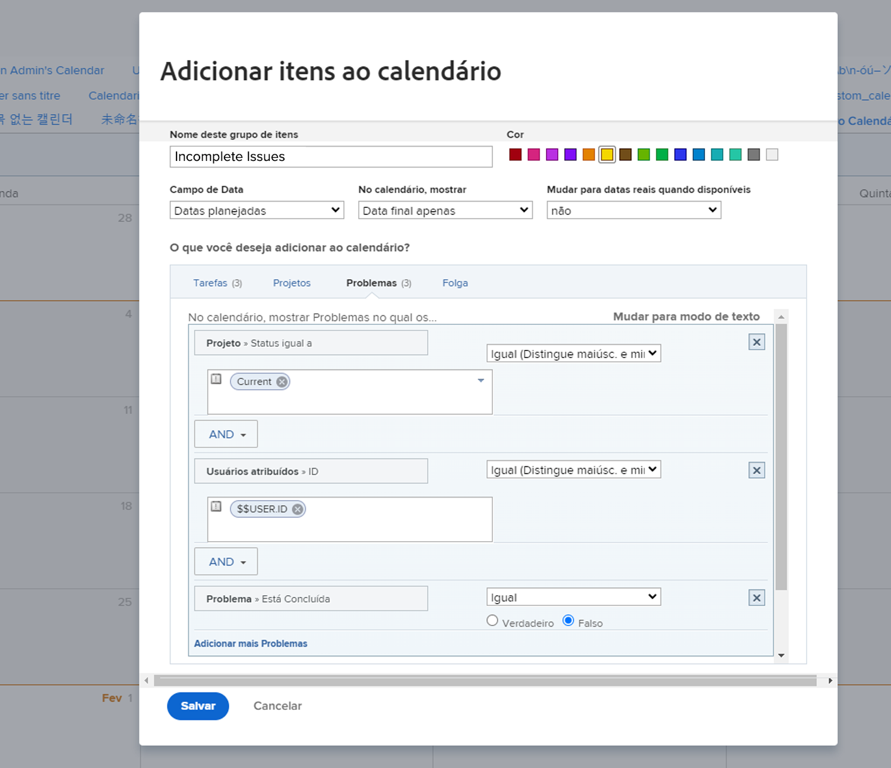

# Sua vez de criar um relatório de calendário

Nesta atividade, você aprenderá na prática como criar o seu próprio calendário.

## Atividade: criar um calendário

Crie um calendário de cliente chamado de “Meu trabalho pendente”.

Inclua um grupo de calendários chamado “Tarefas pendentes”, mostrando todas as tarefas pendentes atribuídas a você nos projetos atuais.

Selecione a cor vermelho para esses itens.

Inclua outro grupo de calendário chamado “Problemas pendentes”, mostrando todos os problemas pendentes atribuídos a você nos projetos atuais. Selecione a cor azul para esses itens.

## Responder

1. Navegue até a área “Calendários” do menu principal.
1. Clique no botão “Novo calendário” e nomeie o calendário como “Meu trabalho pendente”.
1. Clique no botão Adicionar ao calendário e Adicionar itens avançados.
1. Na janela “Adicionar itens ao calendário”, nomeie o grupo como “Tarefas pendentes”.
1. Selecione a cor vermelho.
1. Altere o campo “Data” para “Datas planejadas”.
1. Defina o campo “No calendário, mostrar” como “Somente data final”.
1. Defina o campo “Alternar para as datas reais quando disponíveis” como “Não”.
1. Na seção “O que você gostaria de adicionar ao calendário?”, selecione Tarefas. Em seguida, clique no botão Adicionar tarefas.
1. Adicione três regras de filtro:

   * Projeto > Status igual a > Igual > Atual
   * Usuários atribuídos > ID > Igual > $$USER.ID
   * Tarefa > Está concluída > Igual > Falso

1. Clique em Salvar.

   

1. Crie um segundo agrupamento clicando em Adicionar ao calendário e Adicionar itens avançados.
1. Na janela “Adicionar itens ao calendário”, nomeie o grupo como “Problemas pendentes”.
1. Selecione a cor azul.
1. Altere o campo “Data” para “Datas planejadas”.
1. Defina o campo “No calendário, mostrar” como “Somente data final”.
1. Defina o campo “Alternar para as datas reais quando disponíveis” como “Não”.
1. Na seção “O que você gostaria de adicionar ao calendário?”, selecione Problemas. Em seguida, clique no botão Add Issues (Adicionar problemas).
1. Adicione as três regras de filtro a seguir:

   * Projeto > Status igual a > Igual > Atual
   * Usuários atribuídos > ID > Igual > $$USER.ID
   * Problema > Está completo > Igual > Falso

1. Clique em Salvar.

   

Como você usou $$USER.ID nos filtros, poderá compartilhar este calendário com outras pessoas para que vejam suas próprias tarefas e problemas pendentes.
