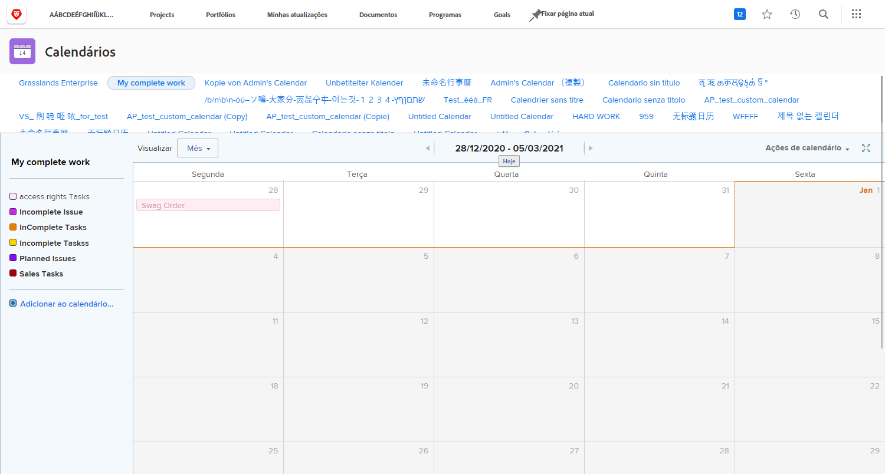

# Sua vez de criar um relatório de calendário

Nesta atividade, você terá experiência prática na criação de seu próprio calendário.

## Atividade: criar um calendário

Crie um calendário de cliente chamado &quot;Meu trabalho incompleto&quot;.

Incluir um grupo de calendário chamado &quot;Tarefas incompletas&quot; mostrando todas as tarefas incompletas atribuídas a você nos projetos atuais.

Selecione vermelho como cor para esses itens.

Incluir outro grupo de calendário chamado &quot;Problemas incompletos&quot; mostrando todos os problemas incompletos atribuídos a você nos projetos atuais. Selecione azul como a cor desses itens.

## Resposta

1. Navegue até a área Calendários no menu Principal.
1. Clique no botão Novo calendário e nomeie o calendário como &quot;Meu trabalho incompleto&quot;.
1. No primeiro agrupamento, clique em Adicionar itens avançados.
1. Na janela Adicionar itens ao calendário que aparece, nomeie o grupo como &quot;Tarefas incompletas&quot;.
1. Selecione vermelho como a cor.
1. Altere o campo Data para Datas planejadas.
1. Defina No calendário, mostrar campo como Somente data final.
1. Defina a opção Alternar para datas reais quando o campo estiver disponível como Não.

   

1. Na página O que deseja adicionar ao calendário?, selecione Tarefas.
1. Adicione três regras de filtro:

   * Projeto > Status igual a > Igual > Atual
   * Atribuição Usuários > ID > Igual > $$USER.ID
   * Tarefa > Está Concluída > Igual > Falso

1. Clique em Salvar.

   

1. Crie um segundo agrupamento clicando em Adicionar ao calendário.
1. Neste agrupamento, clique em Adicionar itens avançados.
1. Na janela Adicionar itens ao calendário que aparece, nomeie o grupo como &quot;Problemas incompletos&quot;.
1. Selecione azul como a cor.
1. Altere o campo Data para Datas planejadas.
1. Defina No calendário, mostrar campo como Somente data final.
1. Defina a opção Alternar para datas reais quando o campo estiver disponível como Não.
1. Na página O que deseja adicionar ao calendário?, selecione Problemas.
1. Adicione as três regras de filtro a seguir:

   * Projeto > Status igual a > Igual > Atual
   * Atribuição Usuários > ID > Igual > $$USER.ID
   * Problema > Está Concluído > Igual > Falso

1. Clique em Salvar.

   

Como você usou $$USER.ID nos filtros, é possível compartilhar este calendário com outras pessoas, e elas verão suas próprias tarefas e problemas incompletos.
