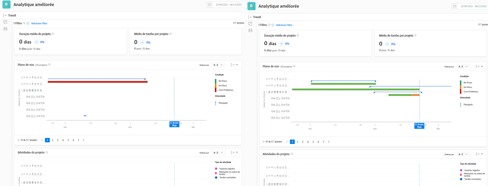

# Entenda os KPIs

Neste vídeo, você aprenderá:

* Como utilizar os dados de KPI

>[!VIDEO](https://video.tv.adobe.com/v/335046/?quality=12&learn=on&enablevpops)

## Comparar KPIs

Os KPIs não apenas fornecem informações valiosas sobre o que está acontecendo no presente, mas também oferecem a capacidade de comparar mudanças nas atividades ao longo do tempo ou a diferença entre portfólios, programas, proprietários de projetos ou qualquer outro filtro usado.

Por exemplo, você pode gerar análises em duas guias do navegador para comparar os KPIs.
