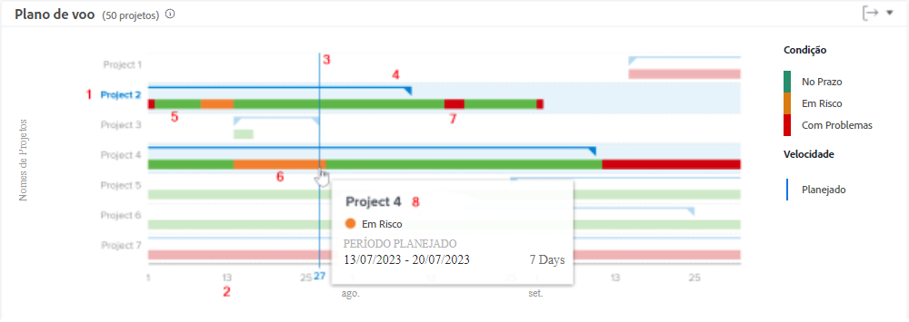
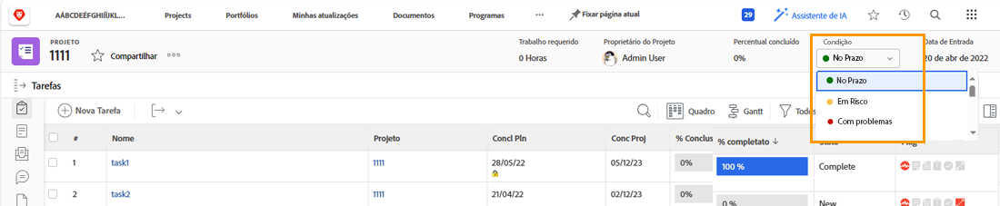
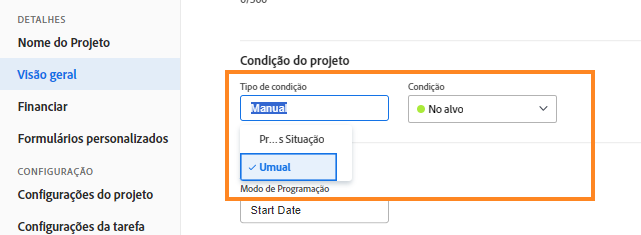

# Entenda a navegação e revisão de projetos

Neste vídeo, você aprenderá:

* Como ler o gráfico Plano de andamento

>[!VIDEO](https://video.tv.adobe.com/v/335047/?quality=12&learn=on)

## Gráfico Plano de andamento

No gráfico, é possível ver que:

1. Os nomes dos projetos estão à esquerda.
1. As datas são exibidas na parte inferior.
1. A linha vertical azul mostra a data específica ao passar o mouse sobre determinada região.
1. As linhas azuis horizontais mostram as datas planejadas de início e término do projeto.
1. As linhas verdes indicam que o projeto está Dentro do prazo.
1. As linhas alaranjadas indicam que o projeto está Em risco.
1. As linhas vermelhas indicam que o projeto está Com problemas.

Ver essas informações sobre os projetos ajuda a determinar:

* Quais eventos prolongam um projeto além da data de conclusão planejada.
* Quando um projeto começa a ter problemas.
* Quantos projetos estão abertos no mesmo período.
* Quantos projetos estão ativos.
* Quais projetos precisam de mais atenção ou suporte.

## A condição é baseada no status do progresso

A condição do projeto é uma representação visual de como o projeto está progredindo. O Workfront determina a condição com base no status do progresso das tarefas no projeto.

A condição de um projeto pode ser definida:

* **Manualmente** por usuários com permissão para gerenciar o projeto, quando o tipo de condição do projeto estiver definido como manual. Isso permite definir a condição do projeto independentemente do caminho crítico.
* **Automaticamente** pelo Workfront, quando o tipo de condição do projeto estiver definido como Status do progresso.

O Workfront recomenda definir o tipo de condição como Status do progresso para ter uma indicação clara do andamento real do projeto, com base no progresso de suas tarefas.

Quando definida como Status do progresso, a condição do projeto pode ser:

* **Dentro do prazo** - Quando o status do progresso da última tarefa no caminho crítico estiver no prazo, a condição do projeto será Dentro do prazo. O projeto está no caminho certo e poderá ser concluído dentro do prazo.
* **Em risco** - Quando o status de progresso da última tarefa no caminho crítico for Atrasado ou Em risco, então a condição do projeto será Em risco. O projeto poderá ser concluído tarde, mas ainda não está atrasado.
* **Com problemas** - Quando o status de progresso da última tarefa no caminho crítico for Atrasado, então a condição do projeto será Com problemas. A data de vencimento já passou e o projeto está atrasado.

>[!NOTE]
>
>As condições podem ser personalizadas para o seu ambiente, portanto, você poderá encontrar mais de três opções e os nomes poderão ser diferentes dos acima. Para obter informações sobre condições de personalização, consulte o artigo [Criar ou editar uma condição personalizada](https://experienceleague.adobe.com/docs/workfront/using/administration-and-setup/customize/custom-conditions/create-edit-custom-conditions.html?lang=pt-BR).
