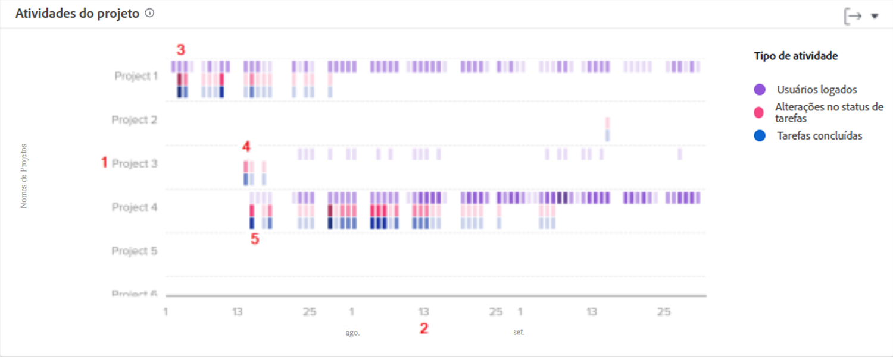

# Entenda como navegar e revisar a atividade do projeto

Neste vídeo, você aprenderá:

* Como comparar projetos com base em usuários conectados, alterações no status da tarefa e tarefas concluídas

>[!VIDEO](https://video.tv.adobe.com/v/335049/?quality=12&learn=on)

## Comparar trabalho do projeto

O gráfico de atividades do projeto permite entender e comparar as atividades do projeto (usuários conectados, alterações de status de tarefas e tarefas concluídas) com outros projetos no Workfront. As atividades do projeto são exibidas em cores diferentes para resumir as atividades ao longo de um período.

Essas informações ajudam a determinar:

* A atividade em um projeto específico.
* A atividade de um projeto em comparação a outros projetos.
* Quais usuários estão trabalhando em um projeto e com que frequência.

No gráfico, você pode ver:

1. Nomes de projetos à esquerda.
1. As datas são exibidas na parte inferior.
1. As caixas roxas mostram que os usuários atribuídos ao projeto fizeram logon nesse dia, e as que possuem um tom mais escuro indicam um número maior de logon de usuários.
1. As caixas rosa mostram que os usuários alteraram o status de uma tarefa do projeto naquele dia, e as que possuem um tom mais escuro indicam um número maior de alterações de status de tarefas.
1. As caixas azuis mostram que os usuários concluíram uma tarefa do projeto, e as que possuem um tom mais escuro indicam um maior número de tarefas sendo concluídas.
