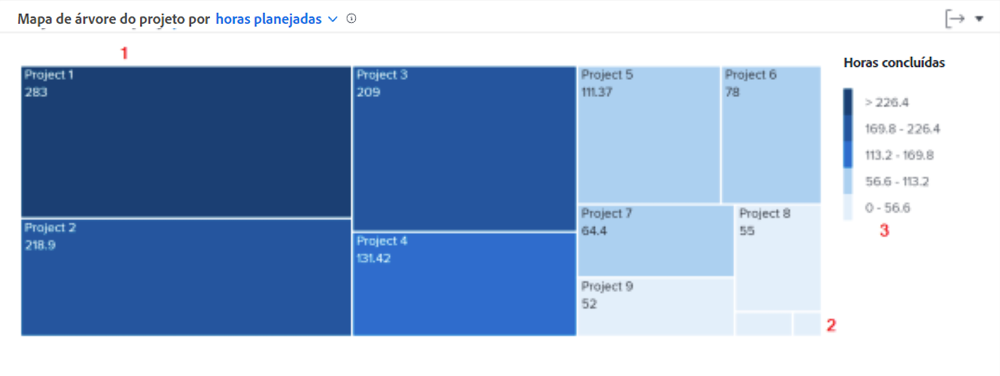

# Saiba mais sobre a navegação

Neste vídeo, você aprenderá:

* Como ver rapidamente quanto tempo os funcionários estão dedicando a cada projeto

>[!VIDEO](https://video.tv.adobe.com/v/335050/?quality=12&learn=on&enablevpops)

## Tempo gasto na revisão dos projetos

O mapa de árvore do projeto permite entender quanto tempo os usuários dedicaram a um projeto. As caixas representam projetos. O tamanho da caixa mostra quanto tempo foi gasto no projeto em comparação com outros projetos. Quanto maior a caixa, mais tempo foi gasto.

Essas informações ajudam a determinar:

* A prioridade dos itens nos quais se trabalhou durante o intervalo de datas selecionado.
* No que os usuários estão gastando tempo.
* Se os usuários estão se concentrando nas coisas certas.
* Ao selecionar um projeto específico, é possível ver o quanto o escopo mudou durante esse período.

No gráfico, você pode ver:

1. Os projetos no período filtrado que têm mais horas concluídas são representados por caixas maiores e com uma cor azul-escuro.
1. Os projetos no período filtrado que têm menos horas concluídas são representados por caixas menores e com uma cor azul-claro.
1. A legenda à direita do gráfico mostra o intervalo de horas concluídas para cada tom de azul.
