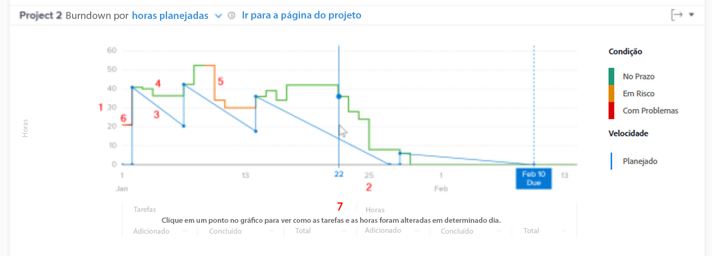

# Entenda como acessar e revisar o detalhamento em [!UICONTROL Análise aprimorada]

Neste vídeo, você aprenderá:

* Como acessar o gráfico de detalhamento
* Como entender a relação entre as horas restantes, a condição do projeto e a velocidade em um projeto

>[!VIDEO](https://video.tv.adobe.com/v/335051/?quality=12)

## Rastrear a velocidade do projeto

O gráfico de detalhamento permite entender a relação entre as horas restantes, a condição do projeto e a velocidade. A linha sólida mostra as horas gastas no projeto ao longo do tempo, bem como a condição do projeto a cada dia. A linha tracejada — que mostra a velocidade planejada da data de início para a data de conclusão planejada — ajusta à medida que as datas das tarefas são alteradas.

Ver essas informações ajuda a determinar:

* A forma como os problemas surgidos (trabalho não planejado) afetaram os trabalhos planejados.
* Quais eventos estenderam seu projeto após a data de conclusão planejada.

No gráfico, é possível ver:

1. Número de horas à esquerda.
1. As datas são mostradas na parte inferior, incluindo a data de conclusão planejada do projeto, se ela for exibida no intervalo de datas selecionado.
1. A linha azul sólida mostra a velocidade do projeto (as horas planejadas ou a duração ao longo do tempo), transformando-se em uma linha vertical tracejada quando atinge a data de conclusão planejada para o projeto.
1. As linhas verdes indicam quando a condição do projeto está no Target.
1. As linhas laranja indicam quando a condição do projeto está em risco.
1. As linhas vermelhas indicam quando a condição do projeto está em problemas.
1. As informações sobre tarefas e horas (totais, quantidade adicionada e quantidade concluída) em um dia específico são exibidas abaixo do eixo x ao clicar em um ponto específico no gráfico.
