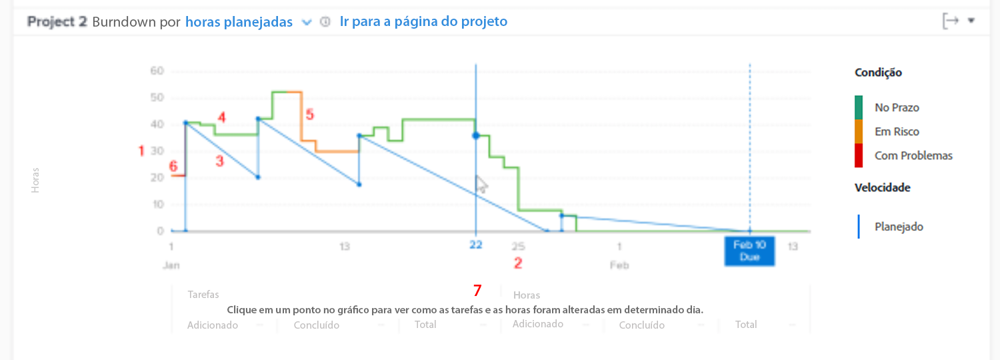

# Entenda como acessar e revisar o gráfico de burndown

Neste vídeo, você aprenderá:

* Como acessar o gráfico de burndown
* Como entender a relação entre as horas restantes, a condição e a velocidade de um projeto

>[!VIDEO](https://video.tv.adobe.com/v/3438889/?captions=por_br&quality=12&learn=on&enablevpops=1)

## Monitorar a velocidade do projeto

O gráfico de burndown permite entender a relação entre as horas restantes, a condição e a velocidade do projeto. A linha sólida mostra as horas gastas no projeto ao longo do tempo, bem como a condição do projeto a cada dia. A linha tracejada, que mostra a velocidade planejada desde a data inicial até a data de conclusão planejada, se ajusta à medida que as datas das tarefas são alteradas.

Essas informações ajudam a determinar:

* Como os problemas (trabalho não planejado) afetaram o trabalho planejado.
* Quais eventos prolongaram seu projeto além da data de conclusão planejada.

No gráfico, você pode ver:

1. Número de horas à esquerda.
1. As datas são exibidas na parte inferior, incluindo a data de conclusão planejada do projeto se ela aparecer no intervalo de datas selecionado.
1. A linha azul sólida mostra a velocidade do projeto (sejam as horas planejadas ou a duração ao longo do tempo); ela se transforma em uma linha vertical tracejada quando atinge a data de conclusão planejada do projeto.
1. As linhas verdes indicam quando a condição do projeto está “Na meta”.
1. As linhas laranja indicam quando a condição do projeto está “Em risco.”.
1. As linhas vermelhas indicam quando a condição do projeto está “Com problemas”.
1. Informações sobre tarefas e horas (totais, quantidade adicionada e quantidade concluída) em um dia específico são exibidas abaixo do eixo x ao clicar em um ponto específico no gráfico.
