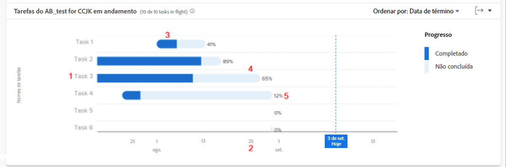

# Revise as tarefas em andamento [!UICONTROL Análise aprimorada]

Neste vídeo, você aprenderá:

* Como acessar as Tarefas no gráfico de voo
* Como visualizar rapidamente quais tarefas não foram concluídas em um projeto

>[!VIDEO](https://video.tv.adobe.com/v/335052/?quality=12&learn=on)

## Dados no nível da tarefa

O gráfico Tarefas em voo permite detalhar as tarefas de um projeto específico para ver a quantidade de trabalho concluído para cada tarefa ativa e como as tarefas são agendadas. O gráfico permite compreender quais tarefas em um projeto precisam ser concluídas e qual a porcentagem de conclusão para essas tarefas.

Essas informações podem ajudar você a determinar:

* O que as pessoas estão trabalhando.
* Que tarefas poderiam estar a pôr em risco um projeto.
* A proximidade de uma tarefa em relação à conclusão.
* Com quem você precisa falar sobre uma tarefa específica.

No gráfico, é possível ver:

1. Nomes de tarefas à esquerda.
1. Datas na parte inferior.
1. A cor azul escuro em uma barra de tarefas indica a quantidade de trabalho concluído para uma tarefa.
1. A cor azul claro em uma barra de tarefas indica a quantidade de trabalho que precisa ser concluída para uma tarefa.
1. O número no lado direito de uma barra de tarefas mostra a porcentagem de conclusão da tarefa.
