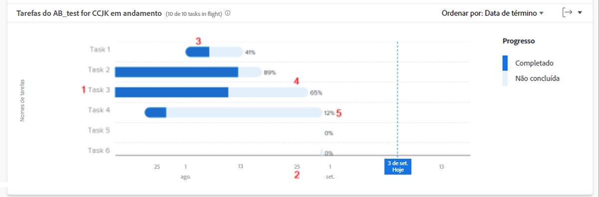

# Revisar as tarefas em andamento

Neste vídeo, você aprenderá:

* Como acessar o gráfico Tarefas em andamento
* Como ver rapidamente quais tarefas não foram concluídas em um projeto

>[!VIDEO](https://video.tv.adobe.com/v/3437005/?captions=por_br&quality=12&learn=on&enablevpops=1)

## Dados no nível da tarefa

O gráfico Tarefas em andamento permite ver detalhes das tarefas de um projeto específico, como a quantidade de trabalho concluído para cada tarefa ativa e se as tarefas estão dentro do cronograma. O gráfico permite entender quais tarefas de um projeto precisam ser concluídas e qual é o percentual de conclusão delas.

Essas informações podem ajudar você a determinar:

* No que as pessoas estão trabalhando.
* Quais tarefas podem estar colocando um projeto em risco.
* Quão perto uma tarefa está da conclusão.
* Com quem você precisa falar sobre uma tarefa específica.

No gráfico, você pode ver:

1. Nomes de tarefas à esquerda.
1. Datas na parte inferior.
1. A cor azul-escuro na barra de tarefas indica a quantidade de trabalho concluído para uma tarefa.
1. A cor azul claro na barra de tarefas indica a quantidade de trabalho que precisa ser concluído para uma tarefa.
1. O número no lado direito da barra de tarefas mostra a porcentagem de conclusão da tarefa.
