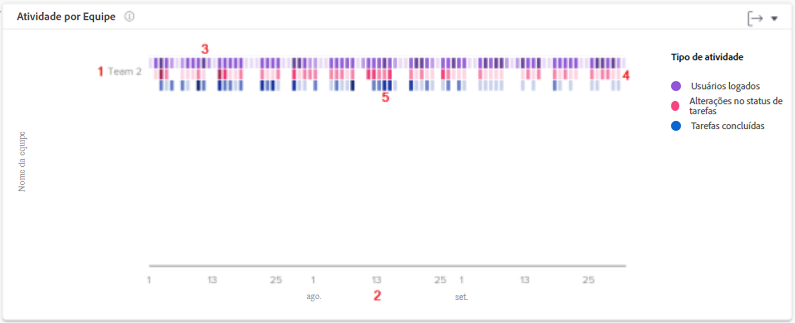

# Entenda a atividade por gráfico de equipe

O gráfico Atividade por equipe permite que você entenda como as equipes internas da sua organização dedicam o tempo no Workfront. Os usuários do Workfront podem estar em várias equipes, mas só podem estar em uma equipe interna. As equipes usadas nos gráficos de Pessoas são compostas apenas pelos usuários que tenham essa equipe designada como equipe interna.

As atividades (usuários conectados, alterações de status da tarefa e tarefa concluída) são exibidas em cores diferentes para resumir esses eventos no período filtrado.

Essas informações ajudam a determinar:

* Quais atividades estão ocorrendo dentro de uma equipe interna e com que frequência.
* Quais equipes internas estão sobrecarregadas ou utilizando mais o sistema.
* Se a distribuição do trabalho é adequada para a equipe interna.

No gráfico, você pode ver:

1. Nomes da equipe interna à esquerda.
1. As datas na parte inferior vêm do intervalo de datas selecionado.
1. As caixas roxas mostram que os usuários atribuídos ao projeto fizeram logon nesse dia, e as que possuem um tom mais escuro indicam um número maior de logon de usuários.
1. As caixas rosa mostram que os usuários alteraram o status de uma tarefa do projeto naquele dia, e as que possuem um tom mais escuro indicam um número maior de alterações de status de tarefas.
1. As caixas azuis mostram que os usuários concluíram uma tarefa do projeto, e as que possuem um tom mais escuro indicam um maior número de tarefas sendo concluídas.

## Como navegar até o gráfico

1. Clique na guia [!UICONTROL Pessoas] no painel esquerdo.
1. Use o [!UICONTROL Filtro] para escolher uma ou mais equipes internas para examinar.
1. Você verá que o gráfico de atividade por equipe é exibido na parte superior dos gráficos de pessoas.
