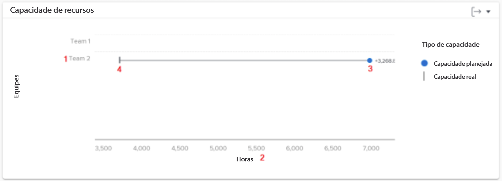
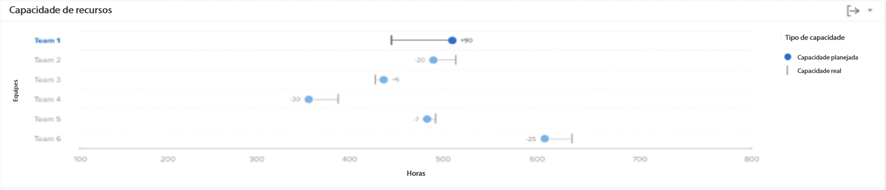

# Entender o gráfico de capacidade de recursos

O gráfico de capacidade de recurso mostra o número de horas planejadas atribuídas a uma equipe inicial dentro do período de tempo filtrado em comparação ao total de horas disponíveis da equipe.

Essa comparação pode ajudar você a determinar se você não está atribuindo trabalho suficiente à equipe ou se eles podem estar experimentando um esgotamento em uma carga de trabalho pesada. Clique em um nome de equipe e um gráfico de capacidade de Equipe será exibido, mostrando mais detalhes sobre a capacidade da equipe para o período filtrado.

Ver essas informações ajuda a determinar:

* Se uma equipe inicial tiver sido atribuída em excesso ou não em alocação.
* Quais equipes domésticas estão disponíveis para trabalho.

No gráfico, você pode ver os seguintes detalhes principais:

1. Os nomes da equipe doméstica estão à esquerda.
1. As horas estão por baixo. Este é o eixo x do gráfico e calcula o intervalo de horas exibido nas equipes acima.
1. O círculo mostra o número de horas planejadas atribuídas à equipe inicial.
1. A linha vertical mostra o número total de horas disponíveis para a equipe inicial.

## Como usar o gráfico

Você deve adicionar filtros e selecionar um intervalo de datas para exibir dados nos gráficos no [!UICONTROL Análise aprimorada] área do Workfront. Se você adicionou filtros anteriormente, eles ficam ativos até que você os remova.

No gráfico de capacidade de recursos, é possível:

* Passe o mouse sobre a linha da equipe inicial para ver quantas horas ainda estão disponíveis para serem programadas, a quantidade de horas planejadas para a equipe inicial ser concluída e o número total de horas trabalhadas (rotuladas como sobre, abaixo ou na capacidade).
* Exporte os dados do gráfico usando o botão Exportar no canto superior direito do gráfico.
* Clique no nome da equipe inicial para abrir o gráfico de capacidade da equipe. Ampliar para um período menor no gráfico de capacidade do grupo atualiza os dados exibidos no gráfico de capacidade do recurso.
