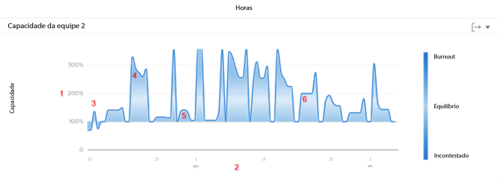
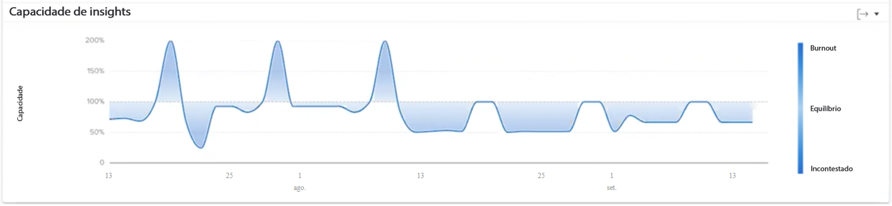

# Entender a capacidade da equipe no [!UICONTROL Analítica aprimorada]

O gráfico Capacidade da equipe mostra quando uma equipe doméstica foi superalocada ou subalocada. O gráfico exibe o volume de trabalho atribuído à equipe da página inicial em um determinado dia e atribui uma cor azul mais escura quando eles estão se aproximando do esgotamento ou não estão sendo desafiados. Uma cor mais clara e transparente indica que a carga de trabalho está mais equilibrada.

Ver essas informações ajuda a determinar:

* Quando a equipe inicial estava superalocada ou subalocada.
* Se a equipe interna estiver superalocada ou subalocada diariamente.
* Quão consistente é a carga de trabalho de uma equipe doméstica no dia a dia.
* Se você estiver criando problemas de capacidade com um novo trabalho.

No gráfico, você pode ver:

1. A porcentagem da capacidade da equipe inicial está à esquerda.
1. As datas na parte inferior vêm do intervalo de datas selecionado.
1. A cor de preenchimento azul mais escura indica que a equipe da casa está com burnout (4) ou não está enfrentando problemas.
1. O azul mais claro ou mais transparente indica que a carga de trabalho da equipe inicial está balanceada

## Como navegar até o gráfico

1. Clique no link [!UICONTROL Pessoas] no painel esquerdo.
1. Use o [!UICONTROL Filtro] para escolher uma ou mais equipes do Início para examinar.
1. Você verá o gráfico de capacidade da equipe abaixo de [!UICONTROL Capacidade de recursos] gráfico.

## Como usar o gráfico

Para exibir dados nos gráficos na seção Pessoas da área do Analytics, você deve adicionar filtros e selecionar um intervalo de datas. Se você tiver adicionado filtros anteriormente, eles estarão ativos até serem removidos.

No gráfico Capacidade da equipe, é possível:

* Passe o mouse sobre um ponto no gráfico para ver a linha de data.
* Passe o mouse sobre um ponto da linha do gráfico para ver as horas programadas e as horas planejadas para uma determinada data, bem como a porcentagem de capacidade e se a equipe doméstica estava acima, abaixo ou na capacidade neste momento.
* Amplie as datas clicando e arrastando o mouse sobre um determinado ponto do projeto. (Essa ação atualiza todos os outros gráficos para ampliar no mesmo intervalo de datas.)
* Exporte os dados do gráfico com o botão de exportação no canto superior direito do gráfico.
