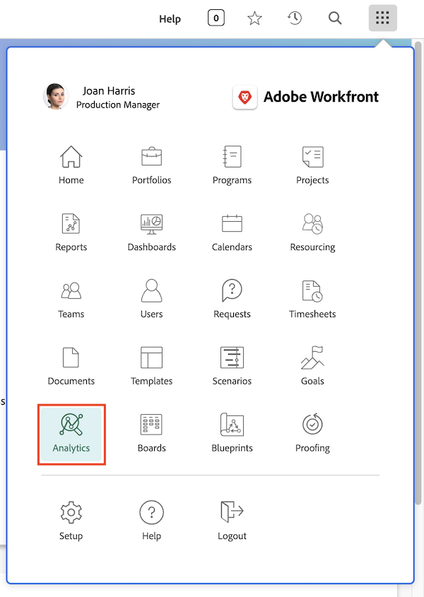

# Como acessar a Analítica aprimorada

Como a maioria dos outros recursos no Workfront, você acessa a [!UICONTROL Analítica aprimorada] no menu principal. Mas a [!UICONTROL Analítica] não está no menu principal por padrão.

Caso não a veja, a administração do sistema ou do grupo precisará adicioná-la para você. Eles farão isso em um modelo de layout. O vídeo abaixo explica como.

## Adicionar a análise aos modelos de layout

Neste vídeo, você aprenderá como admins de sistema e de grupo concedem acesso de [!UICONTROL análise] no Workfront.

>[!VIDEO](https://video.tv.adobe.com/v/335045/?quality=12&learn=on)

Qualquer pessoa com uma licença do Workfront (no [!UICONTROL Workfront Business] ou planos superiores) pode acessar a [!UICONTROL análise] depois de adicioná-la ao modelo de layout ao qual foi atribuída. No entanto, você só verá os projetos e as informações de usuário se possuir o nível de acesso do Workfront e as permissões de compartilhamento de projetos e usuários apropriadas.
