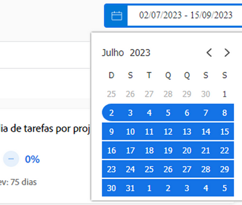
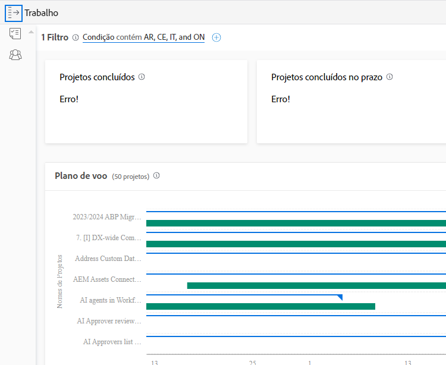

# Entenda intervalos de datas e períodos

Ao visualizar a variável [!DNL Enhanced analytics] gráficos, intervalos de datas são especificados usando o widget calendário. Os intervalos de tempo são criados em um gráfico quando você clica e arrasta para definir uma região específica, para que você possa ampliar e obter uma visão mais detalhada das informações durante esse período.

## Intervalos de datas

Basta clicar em qualquer data no calendário para indicar uma data no intervalo, em seguida, clicar em qualquer data para indicar o outro final do intervalo. Use as setas na parte superior do calendário para navegar até um mês diferente se as datas de início e término não estiverem no mesmo mês.

Os gráficos em [!DNL Analytics] mostrar dados dos últimos 60 dias e dos próximos 15 dias por padrão. Você pode selecionar um novo intervalo de datas e aplicá-lo a todos os gráficos enquanto estiver usando [!DNL Analytics].

Ao atualizar a página, navegar fora ou fazer logout/in do Workfront, o intervalo de datas é redefinido para o padrão.

## Cronogramas

Clique e arraste ao redor de uma seção desejada de uma linha do tempo para criar um filtro de período. Esse período agora se aplica a todos os gráficos na área de Trabalho e aparece ao lado de qualquer outro filtro na barra de filtros. Aprofunde-se em um gráfico clicando e arrastando áreas para atualizar o período. Para remover o filtro de período, basta passar o mouse sobre ele na barra de filtros e clicar no X exibido.

Ao atualizar a página, navegar para fora ou sair do Workfront, o período é removido e o intervalo de datas é redefinido.

>[!NOTE]
>
>Não é possível usar essa opção de período com os gráficos de mapa de árvore Projeto e Capacidade do recurso.
