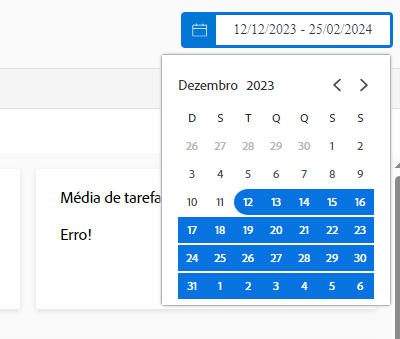

# Entenda sobre intervalos de datas e períodos

Ao visualizar os gráficos da [!DNL Enhanced analytics], os intervalos de datas são especificados usando o dispositivo de calendário. Os períodos são criados em um gráfico quando você clica e arrasta para definir uma região específica, permitindo ampliar e obter uma visão mais detalhada das informações durante esse período.

## Intervalos de datas

Basta clicar em uma data do calendário para iniciar o intervalo e, em seguida, clicar em qualquer outra data para indicar o fim do intervalo. Use as setas na parte superior do calendário para ir para um mês diferente se as datas de início e término não estiverem no mesmo mês.

Os gráficos do [!DNL Analytics] mostram dados dos últimos 60 dias e dos próximos 15 dias por padrão. Você pode selecionar um novo intervalo de datas e aplicá-lo a todos os gráficos enquanto utiliza o [!DNL Analytics].

Quando você atualiza a página, acessa outra página ou entra/sai do Workfront, o intervalo de datas é redefinido para o padrão.

## Períodos

Clique e arraste pela seção desejada de uma linha do tempo para criar um filtro de período. Esse período agora se aplica a todos os gráficos na área de trabalho e aparece próximo aos outros filtros na barra de filtros. Aprofunde-se em um gráfico clicando e arrastando as áreas para atualizar o período. Para remover o filtro de período, basta passar o mouse sobre ele na barra de filtros e clicar no ícone de X que é exibido.

Quando você atualiza a página, acessa outra página ou sai do Workfront, o período é removido e o intervalo de datas é redefinido.

>[!NOTE]
>
>Não é possível usar esta opção de período com o gráfico de mapa de árvore do projeto.
