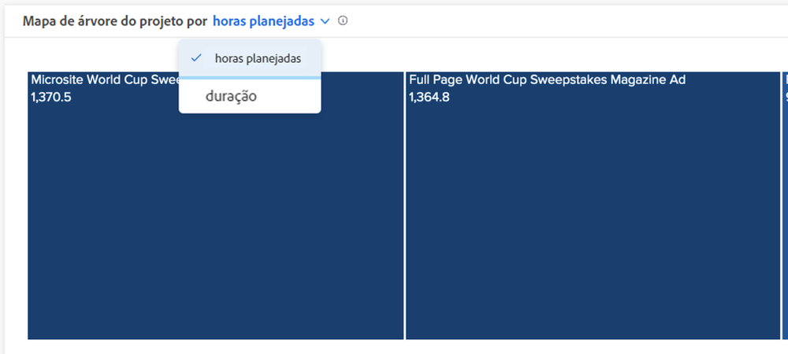

# Entenda as horas planejadas e as exibições de duração em [!UICONTROL Análise aprimorada]

Nos gráficos de Detalhamento e Mapa de árvore do projeto, é possível visualizar as informações por horas ou duração planejadas, dependendo do que você considera mais preciso para seu ambiente Workfront.

As horas planejadas são o padrão. Se você alternar para a duração, isso permanecerá se sair de [!DNL Analytics] e retornar entre logons do Workfront.

## O que significa o tamanho da caixa e a sombra de cores?

Caixas azuis menores e mais claras indicam menos horas, enquanto caixas maiores e tons mais escuros de azul indicam mais horas em comparação. Para obter mais informações, consulte [Entender a visualização do mapa de árvore do projeto](https://experienceleague.adobe.com/docs/workfront/using/reporting/enhanced-analytics/project-treemap-overview.html?lang=en).
