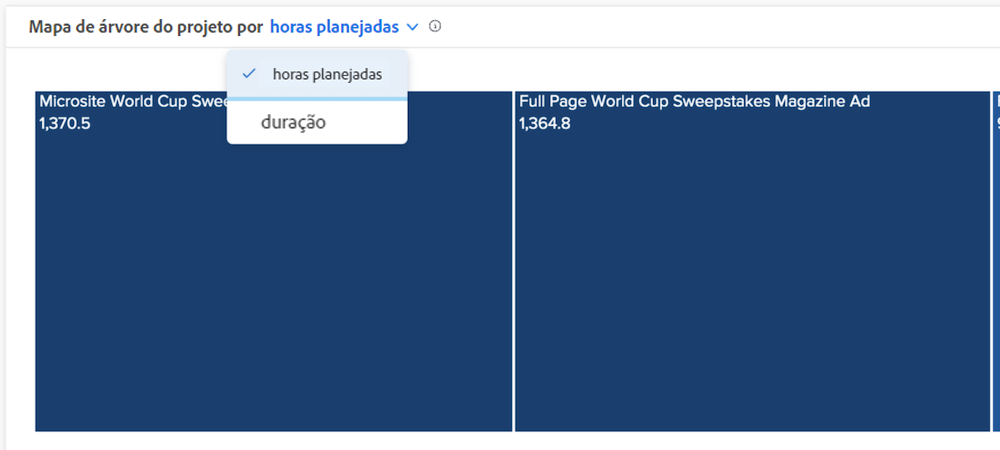

# Entenda as horas planejadas e as visualizações de duração

Nos gráficos de burndown e mapa de árvore do projeto, é possível visualizar as informações por horas planejadas ou duração, dependendo do que você considera mais apropriado para o ambiente do Workfront.

As horas planejadas são o padrão. Se você mudar para duração, essa seleção permanecerá se você navegar para fora do [!DNL Analytics] e voltar, bem como entre logons no Workfront.

## O que significa tamanho da caixa e tom de cor?

Caixas azuis menores e mais claras indicam menos horas, enquanto caixas maiores e tons mais escuros de azul indicam mais horas em comparação. Para mais informações, consulte [Entenda a visualização do mapa de árvore do projeto](https://experienceleague.adobe.com/docs/workfront/using/reporting/enhanced-analytics/project-treemap-overview.html?lang=pt-BR).
