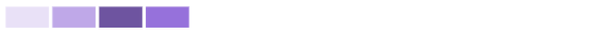

# Entenda as ações: passar o mouse, clicar e arrastar e clicar

Neste vídeo, você aprenderá:

* Como obter mais informações passando o mouse sobre um gráfico
* Criar um período em um gráfico
* Como exibir gráficos adicionais

>[!VIDEO](https://video.tv.adobe.com/v/335044/?quality=12&learn=on&enablevpops=1)

## Clique em um gráfico para obter mais informações

Clicar em determinadas partes de um gráfico revela gráficos adicionais ou mostra um detalhamento das informações do gráfico.

* **Plano de andamento**: clique no nome do projeto para ver os gráficos de Burndown e de Tarefas em andamento.
* **Atividades do projeto**: clique no nome do projeto para expandir o gráfico e ver as atividades do projeto por usuário.
* **Mapa de árvore do projeto**: clique em uma caixa de projeto para exibir os gráficos de Burndown e de Tarefas em andamento.
* **Atividades por equipe**: clique no nome da equipe para expandir o gráfico e ver as atividades por usuário.

## O que representa uma sombra mais escura e mais clara nas atividades de equipe?

**Usuários conectados:** as caixas roxas mostram que usuários da equipe interna fizeram logon naquele dia. Um tom mais escuro indica um número maior de pessoas que fizeram logon.

**Alteração de status da tarefa:** as caixas rosa mostram que usuários da equipe interna mudaram o status de uma tarefa naquele dia. Um tom mais escuro indica um número maior de alterações de status de tarefas.

**Tarefas concluídas:** as caixas azuis mostram que usuários da equipe interna concluíram uma tarefa naquele dia. Um tom mais escuro indica um maior número de tarefas concluídas.

Para obter mais informações, consulte [Entenda a visualização de atividades por equipe](https://experienceleague.adobe.com/docs/workfront/using/reporting/enhanced-analytics/activity-by-team-overview.html?lang=pt-BR).
