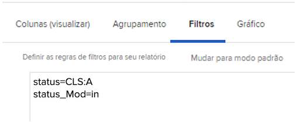

# Entender o modo de texto básico para filtros

Neste vídeo, você aprenderá:

* O modo de texto é
* Qual é o caso do camelo?
* Algum modo de texto &quot;plug and play&quot; básico que você pode usar nos filtros de relatório

>[!VIDEO](https://video.tv.adobe.com/v/336820/?quality=12)

O modo de texto a seguir excluirá tarefas em que um usuário marcou &quot;Concluído com a minha parte&quot;. Tudo o que você precisa fazer é criar um filtro de tarefa, adicionar as regras de filtro desejadas, alternar para o modo de texto e colar o código abaixo após qualquer modo de texto que você ver no filtro.

```
EXISTS:1:$$OBJCODE=ASSGN  
EXISTS:1:taskID=FIELD:ID  
EXISTS:1:status=DN  
EXISTS:1:status_Mod=notin  
EXISTS:1:assignedToID=$$USER.ID 
```

## Atividade: Perguntas sobre o modo de texto

1. Como você escreveria o caso de camelo para o campo intitulado &quot;Inserido por ID&quot;?
1. Em um relatório de Ocorrência , crie um filtro para mostrar os problemas que foram marcados como fechados, mas que estão pendentes de aprovação.

## Respostas

1. O caso de camelo para o campo &quot;Inserido por ID&quot; deve ser escrito da seguinte maneira — enteredByID
1. O modo de texto deve ter esta aparência no filtro de relatório de problemas:

   
