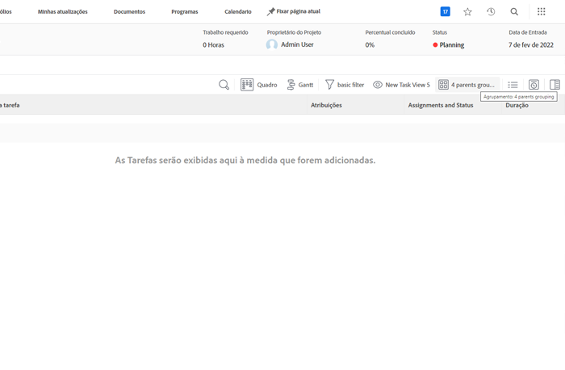
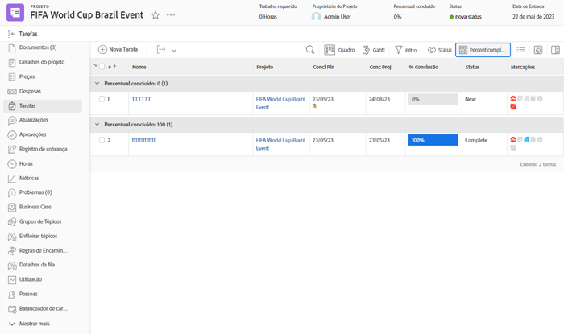
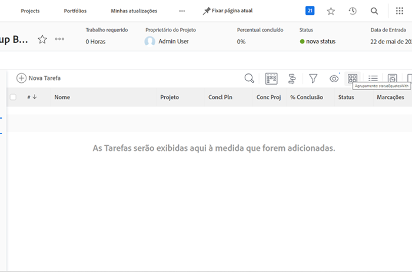
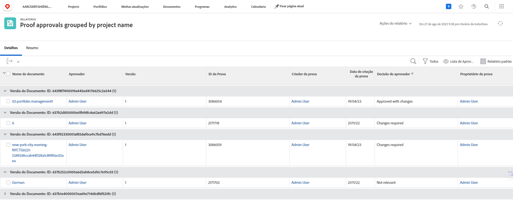
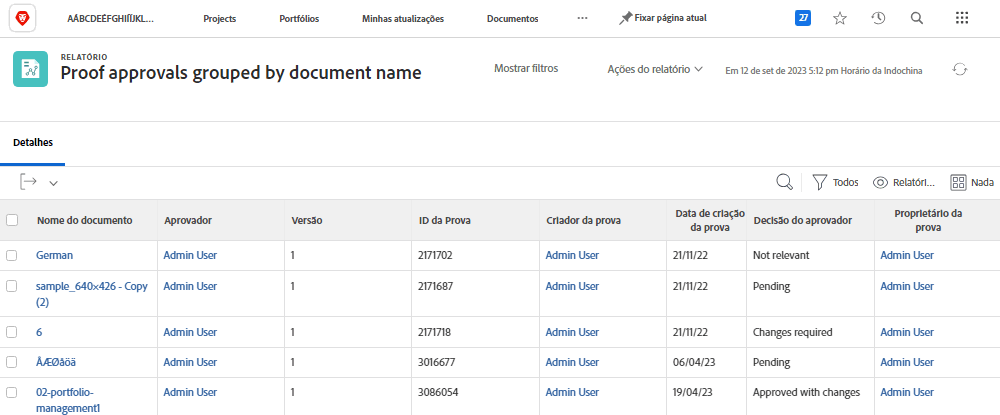

# Entenda o modo de texto básico para agrupamentos

>[!IMPORTANT]
>
>Pré-requisitos:
>
>* Compreender os elementos do relatório
>* Entenda sobre os componentes dos relatórios
>* Criar um agrupamento básico

>[!TIP]
>
>* Para obter uma compreensão mais aprofundada do modo de texto, recomendamos assistir ao evento do webinário gravado [Pergunte ao especialista - Introdução aos relatórios em modo de texto](https://experienceleague.adobe.com/docs/workfront-events/events/reporting-and-dashboards/introduction-to-text-mode-reporting.html?lang=br), que tem uma hora de duração.
>* Para aprender ainda mais sobre o modo de texto, recomendamos assistir aos tutoriais de [Relatórios avançados](https://experienceleague.adobe.com/docs/workfront-learn/tutorials-workfront/reporting/advanced-reporting/welcome-to-advanced-reporting.html?lang=pt-BR), que juntos têm cinco horas e meia de duração.

Neste vídeo, você aprenderá:

* O que é o modo de texto
* O que é camel case
* Um modo de texto “plug and play” básico que você pode usar nos seus agrupamentos

>[!VIDEO](https://video.tv.adobe.com/v/3410641/?quality=12&learn=on)

## Tarefa: agrupamento de quatro páginas principais

O modo de texto a seguir agrupará tarefas com base em até quatro níveis de página principal e deixará as páginas principais inexistentes em branco.

```
textmode=true
group.0.name=Parents
group.0.valueexpression=CONCAT({parent}.{parent}.{parent}.{parent}.{name},IF(ISBLANK({parent}.{parent}.{parent}.{parent}.{name}),"",", "),{parent}.{parent}.{parent}.{name},IF(ISBLANK({parent}.{parent}.{parent}.{name}),"",", "),{parent}.{parent}.{name},IF(ISBLANK({parent}.{parent}.{name}),"",", "),IF(ISBLANK({parent}.{name}),"No parent",{parent}.{name}))
group.0.linkedname=parent
group.0.namekeyargkey.0=parent
group.0.namekeyargkey.1=name
group.0.valueformat=string
```




## Tarefa: agrupamento de percentual concluído

O modo de texto a seguir agrupará tarefas com base no percentual concluído. As tarefas serão encaixadas em uma das seguintes categorias quando agrupadas:

* 0%
* 1% a 25%
* 26% a 50%
* 51% a 75%
* 76% a 99%
* 100%

```
group.0.linkedname=direct
group.0.namekey=percentComplete
group.0.valueexpression=IF({percentComplete}<1,"0%",IF({percentComplete}<26,"1% to 25%",IF({percentComplete}<51,"26% to 50%",IF({percentComplete}<76,"51% to 75%",IF({percentComplete}<100,"76% to 99%",IF({percentComplete}=100,"100","***"))))))
group.0.valueformat=doubleAsString
textmode=true
```



## Tarefa: statusEquatesWith e, em seguida, status

O modo de texto a seguir agrupará as tarefas por statusEquatesWith e, em seguida, por status.

```
group.0.enumclass=com.attask.common.constants.TaskStatusEnum
group.0.enumtype=TASK
group.0.linkedname=direct
group.0.name=State
group.0.type=enum
group.0.valuefield=statusEquatesWith
group.0.valueformat=val
group.1.enumclass=com.attask.common.constants.TaskStatusEnum
group.1.enumtype=TASK
group.1.linkedname=direct
group.1.namekey=status
group.1.type=enum
group.1.valuefield=status
group.1.valueformat=val
textmode=true
```




## Aprovação da revisão: agrupar por nome do projeto

```
group.0.valueformat=HTML
group.0.valuefield=documentVersion:document:project:name
group.0.displayname=Project Name
```




## Aprovação da revisão: agrupar por nome do documento

```
group.0.displayname=Document Name
group.0.valuefield=documentVersion:document:name
group.0.valueformat=HTML
```



