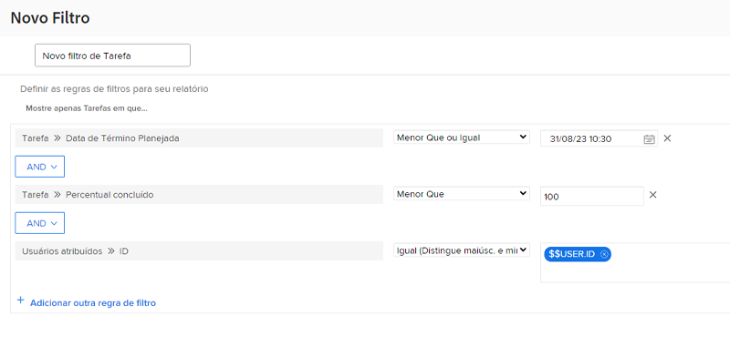

# Criar filtros com curingas baseados em data

Neste vídeo, você aprenderá a:

* Saber quando usar curingas com base em data
* Entender a diferença entre os dois curingas com base em data do Workfront
* Adicionar curinga com base em data a um filtro
* Criar uma data personalizada usando curingas, atributos, operadores e modificadores
* Criar um intervalo de datas personalizado usando curingas

>[!VIDEO](https://video.tv.adobe.com/v/336812/?quality=12)

## Perguntas sobre atividade

1. Como você criaria a regra de filtro se quisesse problemas com data de vencimento ontem ou hoje?
1. Como você criaria a regra de filtro para encontrar projetos com vencimento na semana passada?
1. As regras de filtro a seguir fazem parte de um relatório de tarefas usado regularmente. Que tipo de resultados você obteria com este relatório?

## Respostas

1. Filtrar a data planejada de término do problema entre [!UICONTROL $$TODAY-1d] e [!UICONTROL $$TODAY].
1. Filtrar a data de conclusão planejada do projeto entre [!UICONTROL $$TODAYb-1w] e [!UICONTROL $$TODAYe-1w].
1. Esse relatório encontra tarefas atribuídas a você que ainda não foram concluídas (em outras palavras, têm uma porcentagem concluída inferior a 100) e que estão atrasadas ou com prazo hoje. A regra de filtro para a data de conclusão planejada das tarefas informa a necessidade de observar tarefas com uma data de vencimento igual ou anterior à data de hoje.
