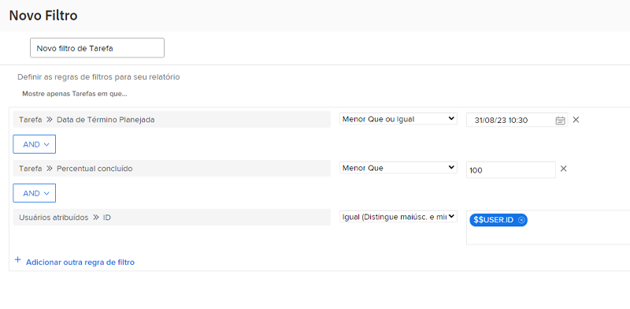

# Criar filtros com curingas baseados em data

Neste vídeo, você aprenderá a:

* Saiba quando usar curingas baseados em data
* Entenda a diferença entre os dois curingas baseados em data do Workfront
* Adicionar um curinga baseado em data a um filtro
* Criar uma data personalizada usando curingas, atributos, operadores e modificadores
* Criar um intervalo de datas personalizado usando curingas

>[!VIDEO](https://video.tv.adobe.com/v/336812/?quality=12&learn=on&enablevpops=0)

## Atividades “Criar filtros com curingas baseados em data”

### Perguntas sobre a atividade

1. Como você criaria a regra de filtro se estivesse procurando por problemas com uma data de vencimento para o dia de ontem ou hoje?
1. Como você criaria a regra de filtro para encontrar projetos com uma data de vencimento para a semana passada?
1. As regras de filtro a seguir fazem parte de um relatório de tarefas que você usa regularmente. Que tipos de resultado você obteria com esse relatório?

### Respostas

1. Filtrar problemas com uma data de conclusão planejada entre [!UICONTROL $$TODAY-1d] e [!UICONTROL $$TODAY].
1. Filtrar projetos com uma data de conclusão planejada entre [!UICONTROL $$TODAYb-1w] e [!UICONTROL $$TODAYe-1w].
1. Este relatório encontrou tarefas atribuídas a você que ainda não foram concluídas (ou seja, têm uma porcentagem de conclusão menor que 100) e que estão atrasadas ou vencem hoje. A regra de filtro para a data de conclusão planejada das tarefas orienta a analisar tarefas que tenham uma data de vencimento igual ou anterior à data de hoje.
