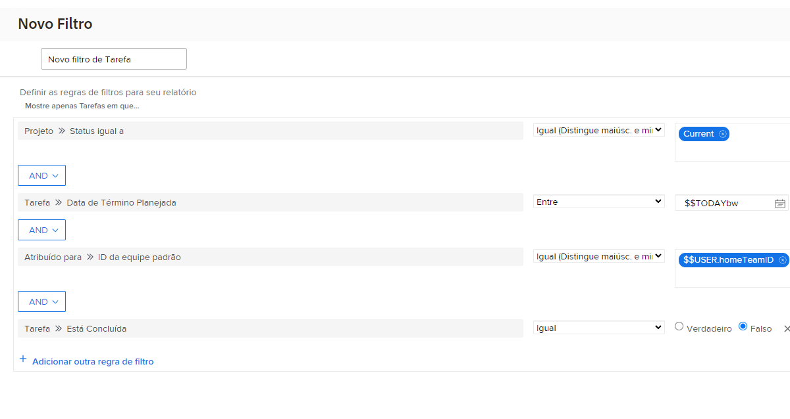

# Crie filtros com curingas baseados no usuário

Neste vídeo, você aprenderá a:

* Entenda por que usar curingas
* Crie um filtro com um curinga baseado no usuário

>[!VIDEO]&#x200B;(https://video.tv.adobe.com/v/336810/?quality=12&learn=on&enablevpops=0)

>[!TIP]
>
>Use origem e nome do campo Usuários atribuídos >> ID, quando criar filtros que exibam uma informação de atribuição de tarefa ou problema.  Essa opção analisa todos os usuários atribuídos à tarefa ou problema, não apenas o &quot;proprietário&quot; ou o responsável principal.

>[!TIP]
>
>Use $$USER.ID (em vez do seu nome) mesmo ao criar filtros para você mesmo(a). Dessa forma, se alguém vir um filtro que você está executando e solicitar que você o compartilhe, ele já estará configurado para que cada pessoa que o utilizar veja suas próprias informações.

>[!TIP]
>
>Use sempre o qualificador de filtro “Igual” ao usar curingas com base no usuário.

## Atividades “Criar filtros com curingas baseados no usuário”

### Atividade 1

Você tem um tempinho extra esta semana e deseja saber se alguém na sua equipe precisa de ajuda com as tarefas. Crie um filtro de tarefas para encontrar tarefas atribuídas à sua equipe inicial que vencem esta semana e ainda não foram concluídas.

### Resposta 1

Ajudar colegas de equipe é uma bela atitude de sua parte. Com o filtro configurado como na imagem abaixo, você encontrará tarefas:

* Que não foram concluídas (o que significa que elas não têm um status [!UICONTROL Concluído] ou equivalente);
* Que estejam em projetos com status [!UICONTROL Atual] (afinal, você não deseja encontrar tarefas para projetos que ainda não foram iniciados);
* Que estejam atribuídas a alguém da sua equipe interna, conforme definido nas configurações de equipe do Workfront;
* E que tenham uma data de conclusão para esta semana (esta regra usou o filtro de data pré-construído para definir “esta semana”).

Pode ser necessário adicionar alguns filtros adicionais se precisar limitar um pouco mais a lista. Por exemplo, você pode querer adicionar uma regra de filtro que analise um programa ou portfólio específico no qual sua equipe trabalha.
