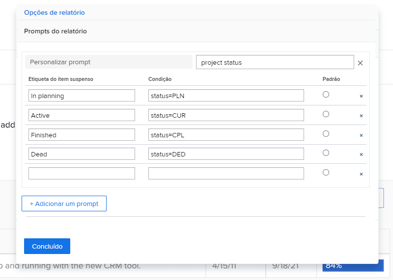
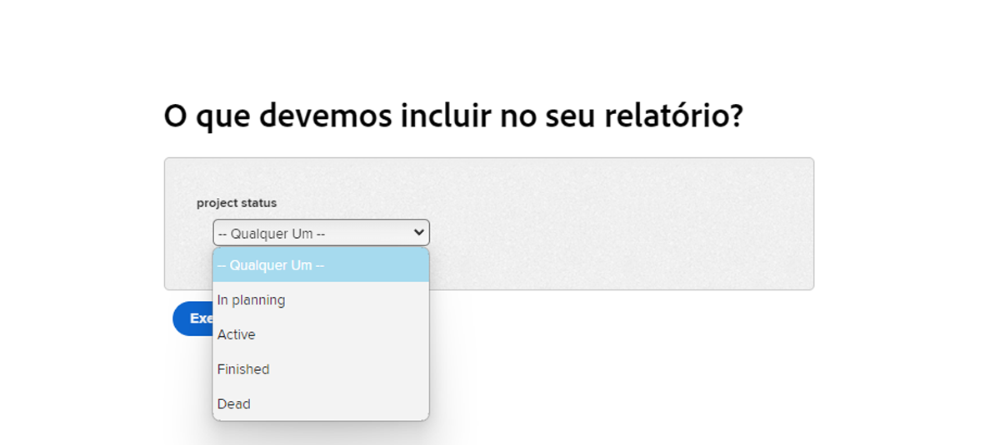
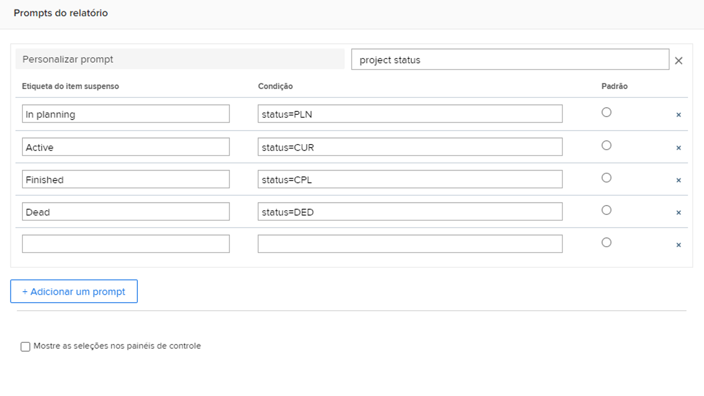

# Criar prompts personalizados

Neste vídeo, você aprenderá:

* O que é um prompt personalizado
* Como criar um prompt personalizado usando o modo de texto
* Alguns exemplos que você pode usar nos relatórios

>[!VIDEO](https://video.tv.adobe.com/v/336822/?quality=12)

## Atividade: criar prompts personalizados

1. Crie um prompt personalizado que mostre os seguintes status do projeto no menu suspenso de prompts:
   * Em Planejamento
   * Em Andamento
   * Concluídos
   * Parado
1. Modifique o prompt para mostrar os projetos atuais que estão vencidos este mês.

## Respostas

1. Seus prompts personalizados devem ser semelhantes a este e ter o seguinte modo de texto:

   

   Depois de salvar o prompt personalizado, o menu suspenso do prompt deverá ter esta aparência:

1. O modo de texto no seu prompt personalizado deve ser semelhante a:



```
   status=CUR&plannedCompletionDate=$$TODAYbm&plannedCompletionDate_Mod=between&plannedCompletionDate_Range=$$TODAYem 
```

E o rótulo suspenso para prompts ativos deve ser atualizado para refletir a alteração no código, desta forma:


