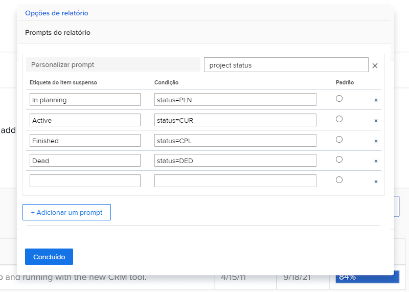
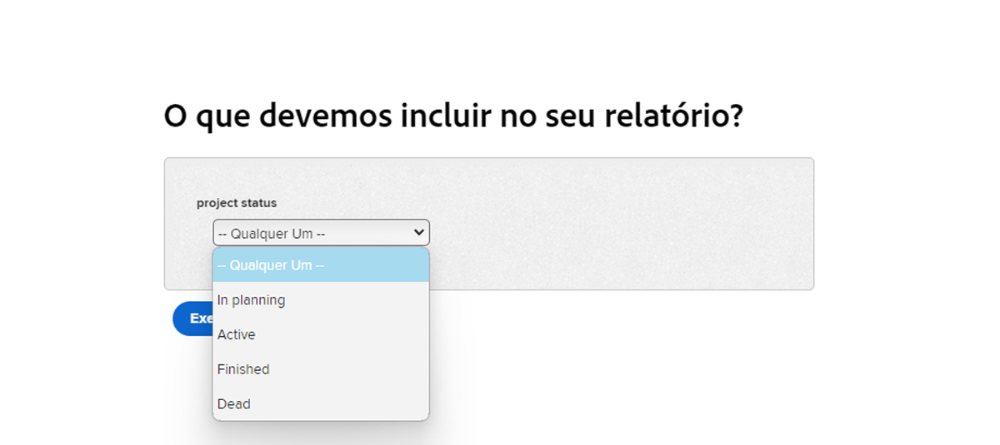
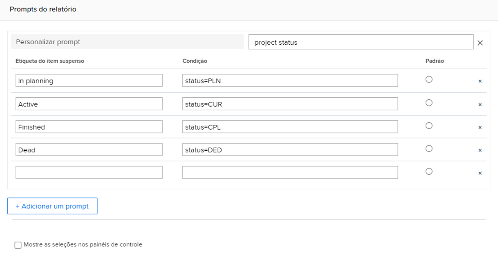

# Criar prompts personalizados usando o modo de texto

Neste vídeo, você aprenderá:

* O que é uma solicitação personalizada
* Como criar uma solicitação personalizada usando o modo de texto
* Alguns exemplos que você pode usar nos relatórios

>[!VIDEO](https://video.tv.adobe.com/v/336822/?quality=12&learn=on&enablevpops=0)

## Atividades “Criar prompts personalizados”


### Atividade: criar solicitações personalizadas

1. Crie uma solicitação personalizada que mostre os seguintes status do projeto no menu suspenso de solicitações:
   * Em Planejamento
   * Em Andamento
   * Concluídos
   * Parado
1. Modifique a solicitação para mostrar os projetos atuais que expiram neste mês.

### Respostas

1. Suas solicitações personalizadas devem ter uma aparência semelhante a esta e usar o seguinte modo de texto:

   

   Após salvar a solicitação personalizada, o menu suspenso da solicitação deverá ter esta aparência:

1. O modo de texto da solicitação personalizada deve ter esta aparência:



```
   status=CUR&plannedCompletionDate=$$TODAYbm&plannedCompletionDate_Mod=between&plannedCompletionDate_Range=$$TODAYem 
```

E o rótulo suspenso para solicitações ativas deve ser atualizado para refletir a alteração no código, desta forma:


