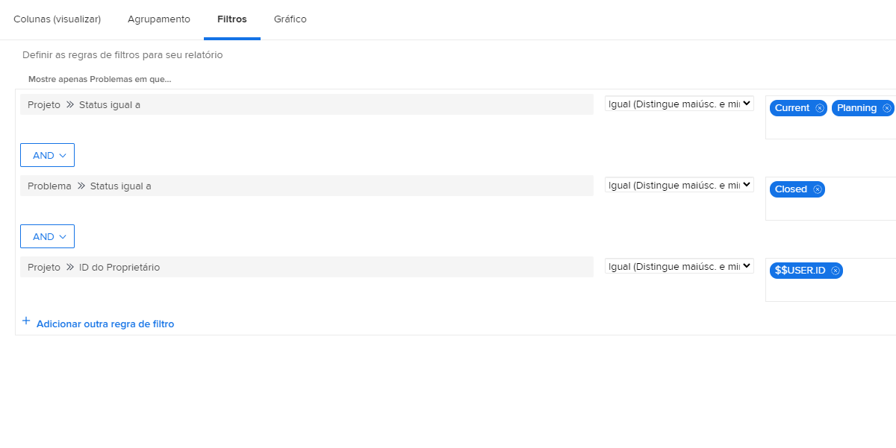
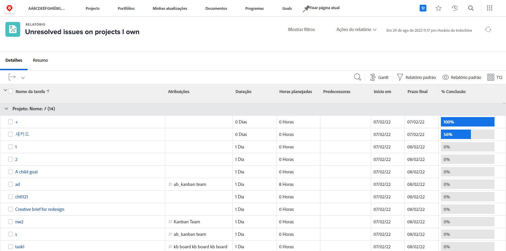

# Entender os filtros de problemas internos

Neste vídeo, você:

* Analise os filtros de problemas internos para ver como eles são criados
* Saiba mais sobre alguns elementos úteis de relatório de problemas
* Saiba como criar seu próprio filtro de problemas

>[!VIDEO](https://video.tv.adobe.com/v/336819/?quality=12)

## Atividade: Criar um relatório de problemas

Você deseja ver todos os problemas que ainda precisam ser resolvidos em todos os projetos ativos de sua propriedade, incluindo problemas com um objeto de resolução. Crie um relatório de problema e o nomeie como &quot;Problemas não resolvidos em projetos que eu possuo&quot;.

## Resposta

Veja como o filtro deve ser:

No filtro interno &quot;Meus problemas em aberto&quot;, uma das regras de filtro excluía quaisquer problemas em que houvesse um objeto de resolução. O raciocínio por trás disso é que você não precisa se preocupar com esses problemas. Alguém já criou um projeto, tarefa ou problema que os resolverá, então o que é que se preocupar? Mas eles ainda não foram resolvidos e, em nosso exemplo, estamos incluindo eles para facilitar a identificação e a verificação de como estão.

Para fazer isso, é necessário adicionar uma coluna na guia view para &quot;Issue > Resolving Object&quot;. Isso mostra o nome do objeto de resolução, se houver, se for um projeto, tarefa ou problema. Clicar no nome leva você ao objeto de resolução.

Talvez você queira agrupar a lista com base no nome do projeto.

É assim que o relatório deve ser:

