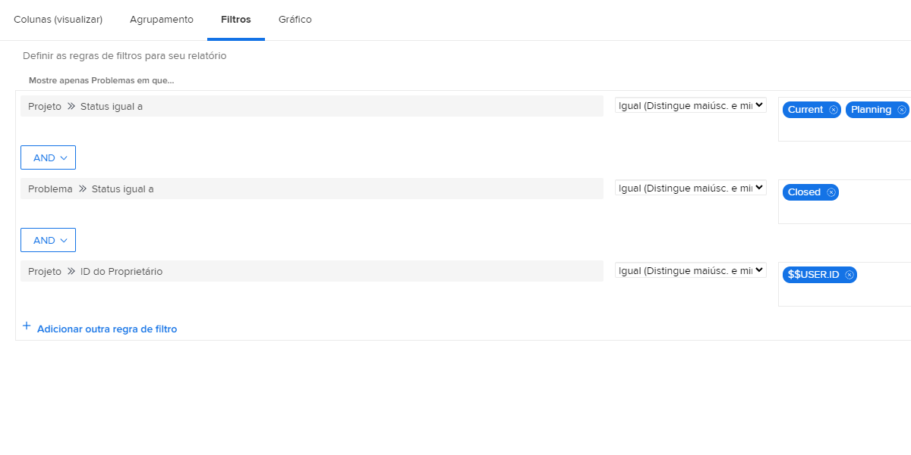
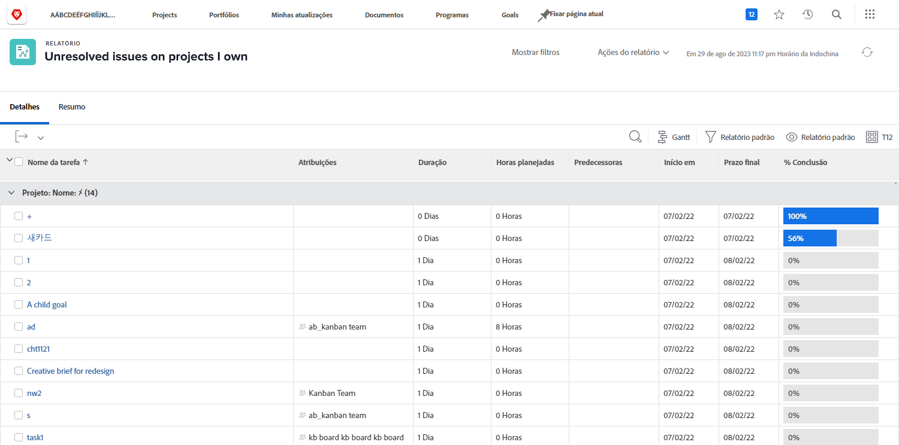

# Explorar filtros de problema integrados

Neste vídeo, você:

* Revise os filtros de problemas integrados para ver como eles são criados
* Saiba mais sobre alguns elementos úteis para relatar problemas
* Aprenda a criar o seu próprio filtro de problemas

>[!VIDEO](https://video.tv.adobe.com/v/336819/?quality=12&learn=on&enablevpops=0)

## Atividades “Compreender filtros de problemas integrados”

### Atividade: criar um relatório de problemas

Você deseja ver todos os problemas que ainda precisam ser resolvidos em todos os projetos ativos que possui, incluindo problemas com um objeto de resolução. Crie um relatório de problemas e nomeie-o como “Problemas não resolvidos em meus projetos”.

### Responder

Esta deve ser a aparência do filtro:

No filtro integrado “Meus problemas abertos”, uma das regras de filtro excluía quaisquer problemas que continham um objeto de resolução. Isso acontece para que você não tenha que se preocupar com esses problemas. Alguém já criou um projeto, tarefa ou problema que os resolverão. No entanto, eles ainda não foram resolvidos e, em nosso exemplo, os incluímos para facilitar sua identificação e verificação.

Para fazer isso, adicione uma coluna na guia de exibição para “Problema >> Objeto de resolução”. Isso mostra o nome do objeto de resolução (se houver), seja um projeto, tarefa ou problema. Clicar no nome leva ao objeto de resolução.

Talvez você queira agrupar a lista com base no nome do projeto.

Esta deve ser a aparência do relatório:

