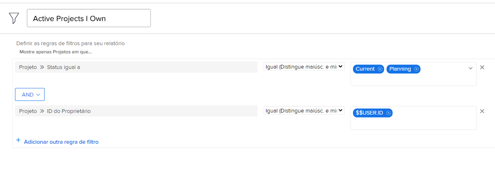

# Entender os filtros de projeto integrados

Neste vídeo, você aprenderá a:

* Revise os filtros de projeto integrados para ver como eles são criados
* Crie seu próprio filtro de projeto usando o que você aprendeu

>[!VIDEO]&#x200B;(https://video.tv.adobe.com/v/336817/?quality=12&learn=on&enablevpops=0)

## Atividades “Compreender filtros de projeto integrados”

### Atividade: criar um filtro de projeto

Você deseja ver todos os projetos ativos de sua propriedade, em que “ativo” significa que o status do projeto é igual a Planejamento ou Atual. Na área Projetos, crie um filtro de projeto chamado “Projetos ativos que possuo”.

### Responder

Seu filtro deve ter esta aparência:

Você pode incluir regras de filtro adicionais, como procurar projetos em um determinado programa ou portfólio. Ao fazer isso, o Workfront recomenda que você renomeie o filtro para algo descritivo apropriado, como “Projetos ativos que possuo no portfólio de marketing”.
