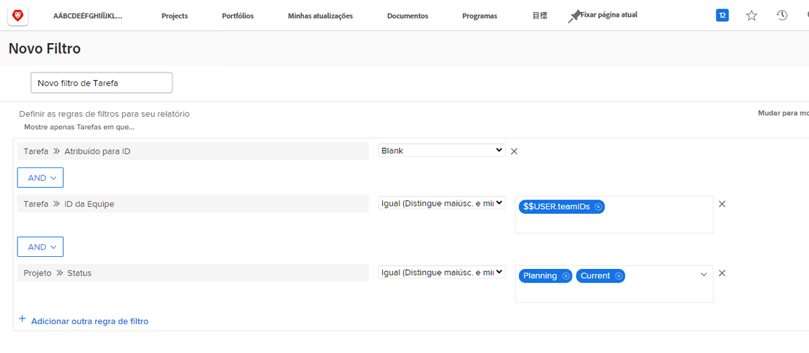
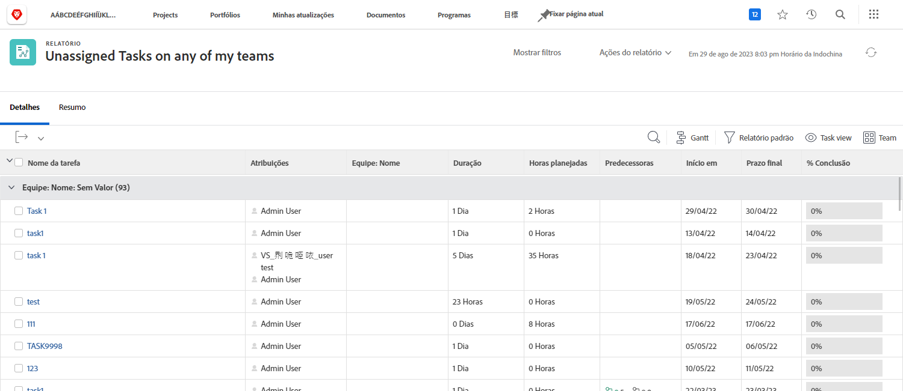

# Entender os filtros de tarefa incorporados

Neste vídeo, você:

* Analise os filtros de tarefa incorporados para ver como eles são criados
* Saiba mais sobre alguns elementos úteis de relatório de tarefas
* Saiba como criar seu próprio filtro de tarefa

>[!VIDEO](https://video.tv.adobe.com/v/336818/?quality=12)

## Atividade: Criar um relatório de tarefa

Certifique-se de estar ciente das tarefas atribuídas a uma de suas equipes que ninguém concordou em trabalhar com ela ainda. Crie um relatório de tarefa chamado &quot;Tarefas não atribuídas em qualquer uma das minhas equipes&quot;.

## Resposta

Veja como o filtro deve ser:

Configure a exibição de coluna para incluir os campos nos quais você está interessado ou gostaria de poder editar em linha. Por exemplo, você pode incluir uma coluna Atribuições para poder atribuir um membro da equipe a uma tarefa diretamente do relatório.

Talvez você queira agrupar a lista com base no nome da equipe atribuída a cada tarefa.

É assim que o relatório deve ser:

