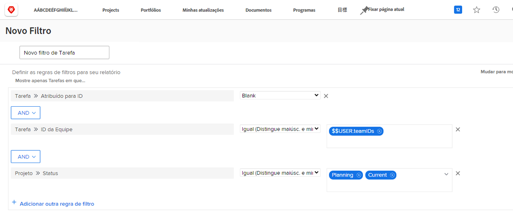
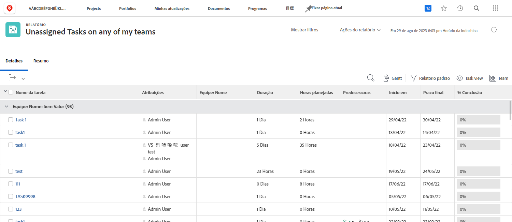

# Explorar filtros de tarefa integrados

Neste vídeo, você:

* Revise os filtros de tarefa integrados para saber como eles são criados
* Saiba mais sobre alguns elementos úteis de relatórios de tarefas
* Saiba como criar seu próprio filtro de tarefas

>[!VIDEO](https://video.tv.adobe.com/v/336818/?quality=12&learn=on&enablevpops=0)

## Atividades “Compreender filtros de tarefas integrados”

### Atividade: criar um relatório de tarefas

Você precisa observar as tarefas atribuídas a uma de suas equipes nas quais ninguém concordou em trabalhar ainda. Crie um relatório de tarefa chamado “Tarefas não atribuídas em uma das minhas equipes”.

### Responder

Esta deve ser a aparência do filtro:

Configure a exibição de coluna para incluir os campos nos quais você tem interesse ou que gostaria de editar em linha. Por exemplo, você pode incluir uma coluna Atribuições para atribuir um membro da equipe a uma tarefa diretamente do relatório.

Você pode até agrupar a lista com base no nome da equipe atribuída a cada tarefa.

O relatório pode parecer assim:

