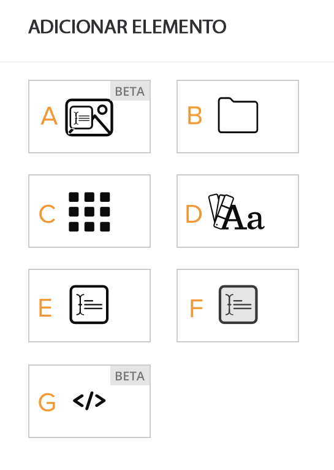

# Personalizar a aparência do [!UICONTROL Brand Connect]

Neste vídeo, você aprenderá a:

* Personalizar a barra de navegação e o rodapé
* Personalizar a página inicial e a página de logon

>[!VIDEO](https://video.tv.adobe.com/v/3418780/?quality=12&learn=on&enablevpops=1&captions=por_br)

## Configuração adicional de [!UICONTROL Aparência]

A opção [!UICONTROL Fonte] abaixo do menu [!UICONTROL Aparência] estiliza todo o texto do [!UICONTROL Brand Portal] com a fonte selecionada. Mais de 800 fontes do Google são compatíveis.

![A opção [!UICONTROL Fonte] abaixo do menu [!UICONTROL Aparência] que estiliza o [!UICONTROL Brand Portal]](assets/02-brand-connect-appearance-font.png)

## Widgets da página inicial

Personalize a aparência da página inicial do [!UICONTROL Brand Connect] de acordo com a sua organização. Use widgets para adicionar elementos como pastas e controles deslizantes de imagens. Se sua organização tiver várias instâncias do [!UICONTROL Brand Connect], cada uma terá sua própria página inicial, as quais podem ter sua própria aparência personalizada.

 do [!UICONTROL Brand Connect]

Estes são os widgets disponíveis:

**A. Carrossel** - Exibe vários ativos em um controle deslizante de imagem. Permite adicionar descrições para cada ativo. Clique no ícone de adição para selecionar imagens a serem exibidas no carrossel.

**B. Pasta** - Exibe uma pasta que contém os ativos selecionados. Clique no ícone de adição para abrir o [!UICONTROL Seletor de ativos] e selecionar uma pasta. Os ativos da pasta podem ser vistos pelos usuários do [!UICONTROL Brand Connect], mas só podem ser baixados por quem possui as devidas permissões.

**C. Lightbox** - Exibe uma [!UICONTROL lightbox] existente. Os ativos da [!UICONTROL lightbox] podem ser vistos pelos usuários do [!UICONTROL Brand Connect], mas só podem ser baixados por quem possui as devidas permissões.

**D. Diretrizes de marca** - Exibe as diretrizes de marca na página inicial além de na (ou em vez da) barra de navegação superior.

**E. Descrição** - Permite exibir textos curtos.

**F. Descrição Preenchida** - Permite inserir um bloco de cópia de texto para ser exibido em um fundo cinza.

**G.HTML** - Permite o uso de HTML e CSS para criar conteúdo personalizado. Por exemplo, você pode incorporar um link para um vídeo. Algumas [tags de HTML devem ser evitadas](https://www.damsuccess.com/hc/en-us/articles/206170043-Brand-Connect-Admin-Guide#html).

## Adicionar uma barra de pesquisa

Se você criar uma página inicial personalizada para o [!UICONTROL Brand Connect] da sua organização, os usuários e usuárias precisarão clicar na área [!UICONTROL Ativos] para realizar uma pesquisa.

Mas admins de sistema podem criar uma barra de pesquisa usando o widget HTML e esta tag de HTML:

&lt;webdambp.headersearch>&lt;/webdambp.headersearch>
