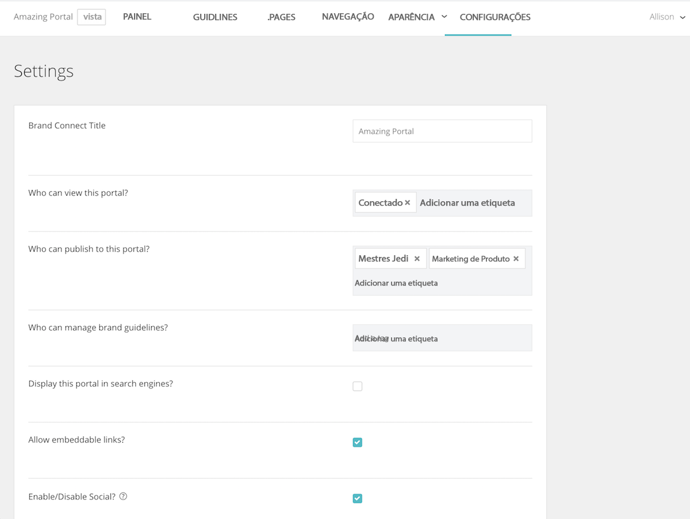

# Estabeleça as configurações do sistema em [!UICONTROL Conexão de marca]

O [!UICONTROL Conexão de marca] as configurações controlam quem pode ver o portal, quem pode publicar conteúdo no portal e quem pode gerenciar as diretrizes da marca.

Para acessar as configurações, faça logon em [!UICONTROL Workfront DAM].

1. Clique no botão **ícone de configurações** na barra de navegação e selecione **[!UICONTROL Conexão de marca]**. Ou clique em **[!UICONTROL Marcas]** na barra de navegação.
1. Em seguida, clique no botão **[!UICONTROL Editar]** no canto superior direito do [!UICONTROL Conexão de marca] painel. Se sua organização tiver várias [!UICONTROL Conexões da marca], certifique-se de editar a opção correta.

Fale com o seu [!UICONTROL Workfront] consultor se tiver dúvidas sobre qualquer uma dessas configurações.

* **[!UICONTROL Conexão de marca] Título**—Nomeie o [!UICONTROL Conexão de marca] (ou alterar o nome).
* **Quem pode ver este portal?**—Defina os grupos que podem visualizar o [!UICONTROL Conexão de marca]. Por exemplo, se você adicionar a variável [!UICONTROL Conectado] , todos os usuários conectados podem ver o portal. No entanto, as permissões de pasta ainda se aplicam. Dessa forma, mesmo que o usuário possa ver o portal, ele não poderá acessar os ativos a menos que a variável [!UICONTROL Conectado] O grupo recebeu permissões para a pasta.
* **Quem pode publicar neste portal?**—Defina os grupos que podem publicar ativos no [!UICONTROL Conexão de marca]. Esses serão grupos de colaboradores. Eles só podem publicar itens aos quais têm acesso.
* **Quem pode gerenciar as diretrizes da marca?**—Defina os grupos que podem gerenciar as Diretrizes de marca. O gerenciamento das diretrizes não está limitado aos usuários administradores. Você pode definir um grupo de colaboradores para editar as diretrizes.
* **Exibir este portal em mecanismos de pesquisa?**—Você quer o [!UICONTROL Conexão de marca] URL a ser exibido quando as pessoas executam pesquisas na Internet?
* **Permitir links incorporados?**—É possível incorporar links provenientes do [!UICONTROL Conexão de marca]? Isso adiciona uma [!UICONTROL Obter links] para [!UICONTROL Compartilhar] que fornece links incorporados para o ativo.
* **Ativar/desativar o social?**—Se o social estiver ativado (marque a caixa), os usuários podem curtir e fazer comentários sobre os ativos.
* **Ativar/desativar download e visualizar contagem?**—Quando ativado, os usuários podem ver quantas vezes um ativo foi baixado e quantos comentários ele tem.
* **Ocultar aspectos inicialmente**—Oculta os filtros de pesquisa de metadados que aparecem no painel esquerdo do [!UICONTROL Ativos] página.
* **Rótulo do Lightbox**—Selecione um rótulo para [!UICONTROL Lightboxes] — [!UICONTROL Lightbox], [!UICONTROL Coleção], [!UICONTROL Favoritos]ou [!UICONTROL Favoritos].
