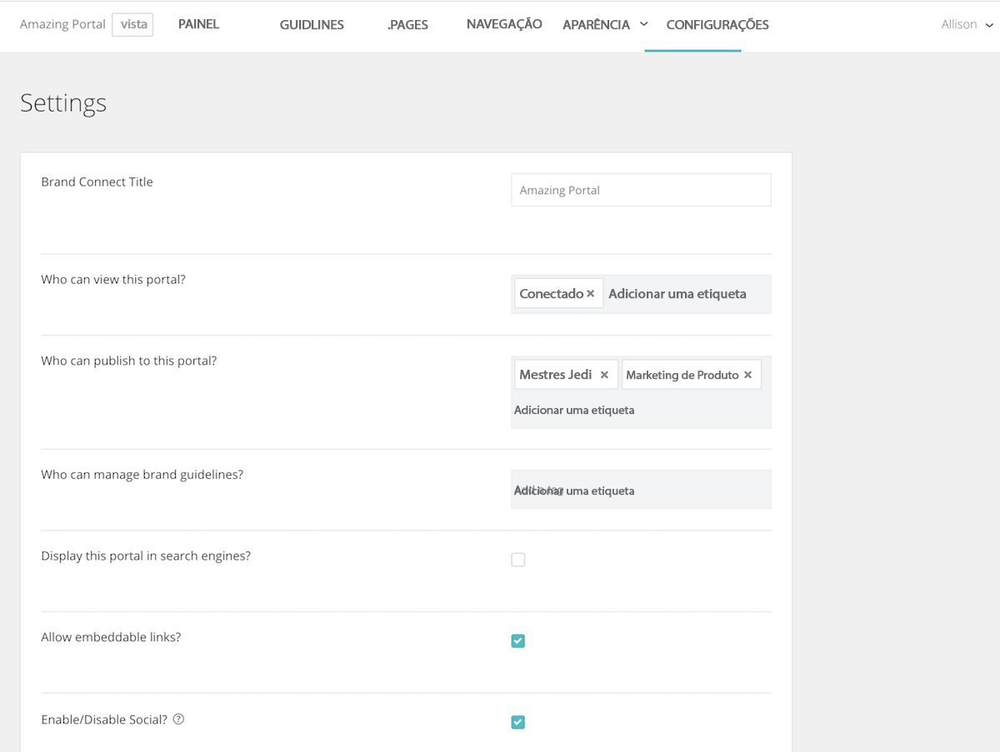

# Definir as configurações do sistema no [!UICONTROL Brand Connect]

As configurações do [!UICONTROL Brand Connect] controlam quem pode ver o portal, publicar conteúdo no portal e gerenciar as diretrizes da marca.

Para acessar as configurações, faça logon no [!UICONTROL DAM do Workfront].

1. Clique no **ícone de configurações** na barra de navegação e selecione **[!UICONTROL Brand Connect]**. Ou clique em **[!UICONTROL Marcas]** na barra de navegação.
1. Em seguida, clique na opção **[!UICONTROL Editar]** no canto superior direito do painel do [!UICONTROL Brand Connect]. Se sua organização tiver várias instâncias do [!UICONTROL Brand Connect], certifique-se de estar editando a correta.

Converse com o(a) consultor(a) do [!UICONTROL DAM do Workfront] se tiver dúvidas sobre qualquer uma dessas configurações.

* Título do **[!UICONTROL Brand Connect]** - Nomeia o [!UICONTROL Brand Connect] (ou altera o nome).
* **Quem pode exibir este portal?**—Defina os grupos que podem exibir o [!UICONTROL Brand Connect]. Por exemplo, se você adicionar o grupo [!UICONTROL Conectado], todos os usuários conectados poderão ver o portal. No entanto, as permissões de pasta ainda se aplicam, portanto, mesmo que um usuário possa ver o portal, ele não poderá acessar os ativos a menos que o grupo [!UICONTROL Conectado] tenha recebido as permissões para a pasta.
* **Quem pode publicar neste portal?**—Defina os grupos que podem publicar ativos no [!UICONTROL Brand Connect]. Estes serão grupos colaboradores. Eles só podem publicar itens aos quais tenham acesso.
* **Quem pode gerenciar as diretrizes de marca?**—Defina os grupos que podem gerenciar as Diretrizes de Marca. O gerenciamento das diretrizes não se limita a usuários admins. Você pode definir um grupo de colaboradores para editar as diretrizes.
* **Exibir este portal em mecanismos de pesquisa?**—Deseja que a URL do [!UICONTROL Brand Connect] seja exibida quando as pessoas executarem pesquisas na Internet?
* **Permitir links incorporados?** — Os links incorporados podem vir do [!UICONTROL Brand Connect]? Isso adiciona um painel [!UICONTROL Obter links] ao menu [!UICONTROL Compartilhar] que fornece links incorporáveis para o ativo.
* **Habilitar/Desabilitar redes sociais?** — Se o recurso social estiver habilitado (marque a caixa), os usuários poderão gostar e comentar nos ativos.
* **Habilitar/desabilitar o download e a contagem de exibições?**—Quando habilitado, os usuários podem ver quantas vezes um ativo foi baixado e quantos comentários ele tem.
* **Ocultar aspectos de pequisa inicialmente** - Oculta os filtros de pesquisa de metadados que aparecem no painel esquerdo da página [!UICONTROL Ativos].
* **Rótulo de lightbox** - Selecione um rótulo para [!UICONTROL lightboxes]: [!UICONTROL Lightboxes], [!UICONTROL Coleção] ou [!UICONTROL Favoritos].
