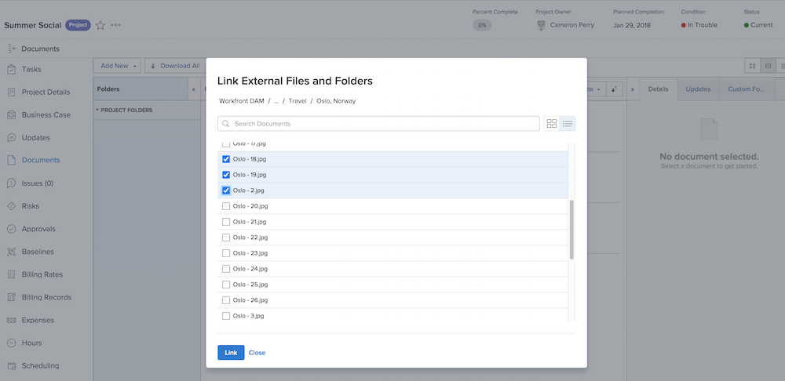

# Adicionar um link do [!UICONTROL DAM do Workfront]

Comece configurando a conexão entre os dois sistemas.

1. Faça logon no [!DNL Workfront].
1. Abra um projeto, tarefa ou problema, e clique na guia **[!UICONTROL Documentos]**.
1. Clique no botão **[!UICONTROL Adicionar novo]** e selecione **[!UICONTROL Do Workfront DAM]** no menu suspenso.
1. Digite o seu nome de logon e senha na caixa de autorização do [!UICONTROL Workfront DAM] que aparece.
1. Em seguida, clique em **[!UICONTROL Sim]** para dar ao [!DNL Workfront] acesso à conta do [!UICONTROL DAM].
1. Se necessário, atualize a página para atualizar o acesso ao [!UICONTROL Workfront DAM].

Agora você pode colocar um link para o item do [!UICONTROL Workfront DAM] no [!DNL Workfront].

1. Faça logon no [!DNL Workfront].
1. Abra um projeto, tarefa ou problema, e clique na guia **[!UICONTROL Documentos]**.
1. Clique no botão **[!UICONTROL Adicionar novo]** e selecione **[!UICONTROL Do Workfront DAM]** no menu suspenso.
   ![Uma imagem da opção [!UICONTROL Do Workfront DAM] no menu suspenso [!UICONTROL Adicionar novo] ](assets/01-contributor-from-workfront-dam.png)
1. Uma lista de arquivos e pastas aos quais você tem acesso no [!UICONTROL Workfront DAM] é exibida na janela.

1. Encontre o ativo que você procura e marque a caixa ao lado dele. A visualização padrão é uma lista, mas você pode alternar para uma visualização em miniatura com os ícones no canto superior direito da janela.

   

1. Clique no botão **[!UICONTROL Vincular]**. Um link para o arquivo do [!UICONTROL Workfront DAM] aparece na lista de documentos. Um ícone indica esse link.

   ![Uma imagem dos links para os arquivos do [!UICONTROL Workfront DAM] exibidos na lista de documentos do [!DNL Workfront].](assets/03-contributor-linked-in-wf.png)
