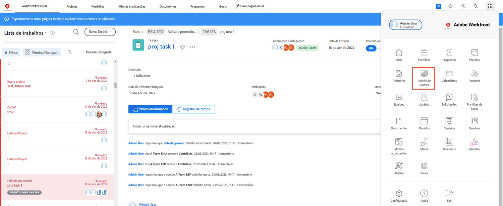
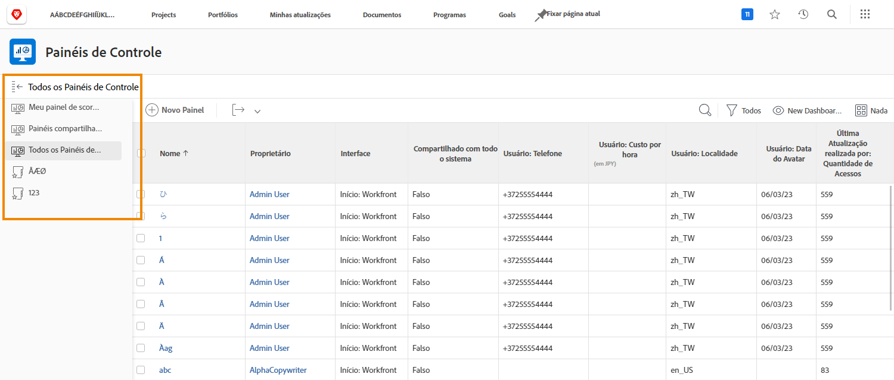
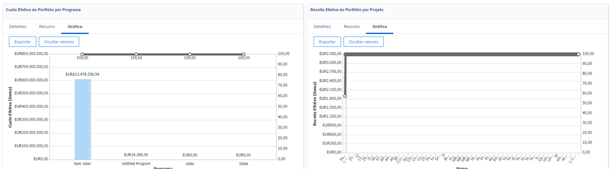
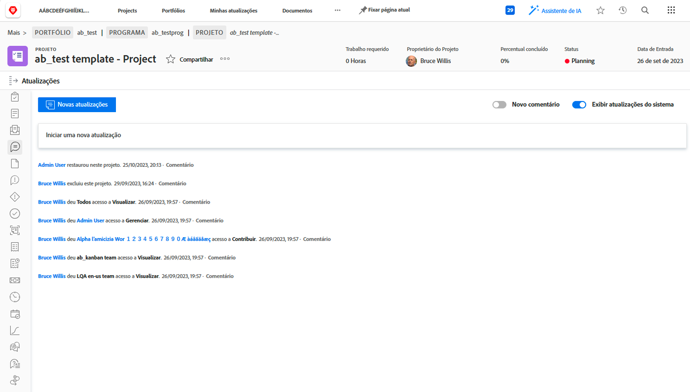
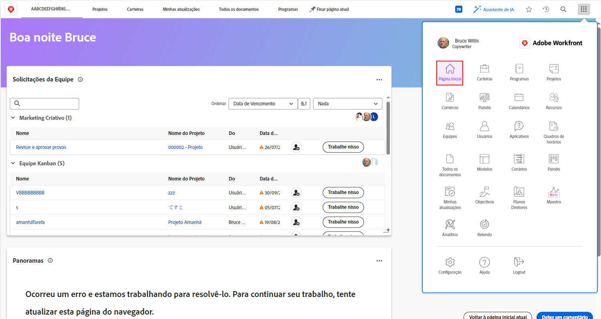

# Workfront para executivos

Saiba como o Workfront pode ajudar você a gerenciar trabalhos em sua organização.

Como executivo, o Adobe Workfront lhe permite:

* Receber informações sobre o progresso de um trabalho de seu interesse por meio de **relatórios e painéis**
* **Comunicar-se facilmente com as partes interessadas do projeto por meio de atualizações**
* **Fazer uma solicitação de trabalho** com facilidade
* **Identificar itens que aguardam sua aprovação** com facilidade

## Relatórios e painéis de controle

### Relatórios

Os relatórios do Workfront são a base para tomar decisões melhores e mais rápidas. Você pode vê-los em qualquer lugar: na área de projetos, na área de pessoas ou na página de destino de uma tarefa.

Líderes e executivos podem navegar até a área de relatórios para visualizar relatórios personalizados com informações específicas. Para aumentar a visibilidade dos relatórios mais importantes, o Workfront usa painéis.

### Painéis

Ao usar um painel, líderes podem visualizar e fazer uma busca detalhada e rápida em qualquer parte do trabalho atual de sua organização. O painel é simplesmente uma coleção de relatórios que fornecem informações necessárias para líderes com frequência. Os painéis são totalmente personalizáveis para que qualquer pessoa que utilize o Workfront possa ver o trabalho que é importante para ela.

Clique em Painéis no ícone do menu principal no canto superior direito para acessar a área de painéis.

Líderes podem acessar os diferentes painéis disponíveis utilizando a navegação do painel esquerdo.

* **Todos os painéis**: exibe os painéis que você ou outros usuários criaram e para os quais você tem ao menos uma permissão de visualização.
* **Meus painéis**: exibe os painéis que você criou.
* **Painéis compartilhados**: exibe os painéis que foram criados por outros usuários e compartilhados com você.

Um painel permite que líderes revisem informações como “Custos, receitas e orçamentos” referentes a projetos importantes, bem como problemas com os quais suas equipes estão lidando. Os painéis também permitem ver os projetos que estão em risco, além de uma lista de itens que precisam de aprovação executiva.

Os relatórios do Workfront podem ajudar a desenvolver um senso de responsabilidade em seus funcionários. A chave para aproveitar os relatórios é estabelecer um fluxo de trabalho claro, de acordo com a maneira que sua organização os utiliza. Certifique-se de que todos(as) tenham uma compreensão clara de quais relatórios estão sendo usados para medir o sucesso.

Exemplo de relatórios em um painel no Workfront

## Comunique-se com as partes interessadas do projeto utilizando as atualizações

Comunique-se com a equipe do projeto dentro do próprio projeto para que as informações relevantes sejam facilmente acessíveis.

## Fazer uma solicitação

Em muitas organizações, o primeiro passo para iniciar um novo projeto, desenvolver um novo produto ou criar entregáveis é fazer uma solicitação no Workfront. Você pode acompanhar o progresso da solicitação e fornecer informações adicionais quando necessário.

Neste vídeo, você aprenderá a:

* Navegue até a área de solicitação
* Fazer uma solicitação
* Visualize as solicitações enviadas

>[!VIDEO](https://video.tv.adobe.com/v/336092/?quality=12&learn=on)

## Itens que aguardam sua aprovação

Na [!UICONTROL página inicial] você pode encontrar itens que aguardam sua aprovação com facilidade.

