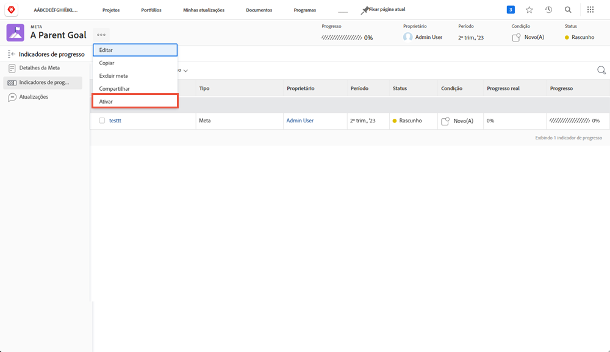

# Ativar uma meta alinhando-a a outra

Quando você alinha duas metas, uma se torna a meta principal e a outra se torna a meta secundária. Uma meta principal pode ter várias metas secundárias, mas uma meta secundária só pode se alinhar a uma meta principal.

1. Abra a meta secundária clicando no nome dela na [!UICONTROL Lista de metas]. Por padrão, a guia [!UICONTROL Detalhes da meta] será aberta.
1. Clique no botão [!UICONTROL +Adicionar] no painel [!UICONTROL Informações sobre a meta principal].

   ![Uma captura de tela da guia [!UICONTROL Detalhes da meta]](assets/06-workfront-goals-align-goals.png)

1. Comece a digitar o nome da meta principal desejada no campo [!UICONTROL Meta principal] e selecione-o quando aparecer na lista. Somente metas do mesmo período ou de um período futuro aparecem na lista.

   ![Uma captura de tela do painel [!UICONTROL Detalhes da meta] mostrando o painel [!UICONTROL Informações da meta principal]](assets/07-workfront-goals-align-to.png)

1. Clique em [!UICONTROL Salvar alterações].

Alinhar uma meta a outra cria uma meta secundária. Pense nas metas secundárias como metas individuais que contribuem para o progresso das metas principais da organização ou da equipe. As metas secundárias podem ativar e influenciar o progresso da meta principal.

## Agora, ative a meta principal

Agora que você criou uma meta secundária, ela se tornará um indicador de progresso da meta principal. Você verá a opção “Ativar” ao clicar no menu de três pontos ao lado do nome da meta principal.

