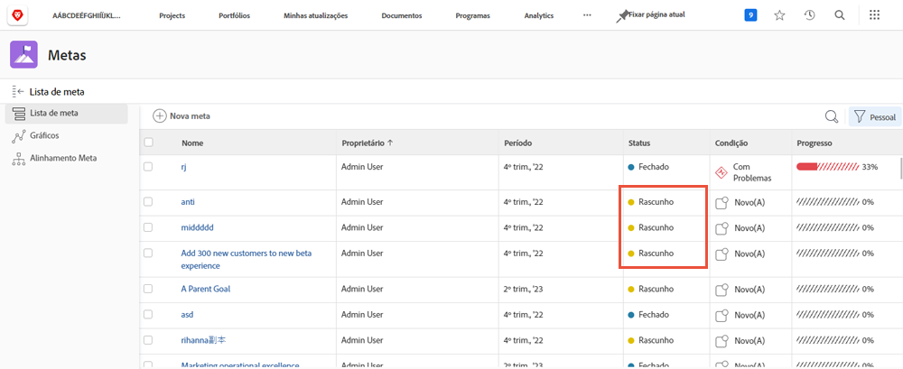
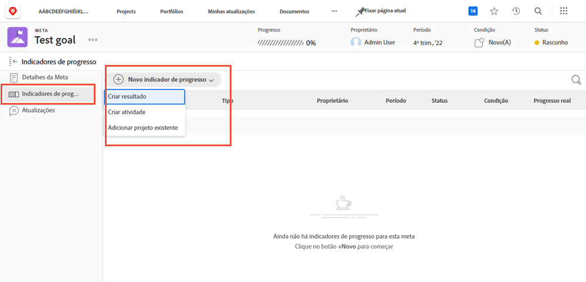
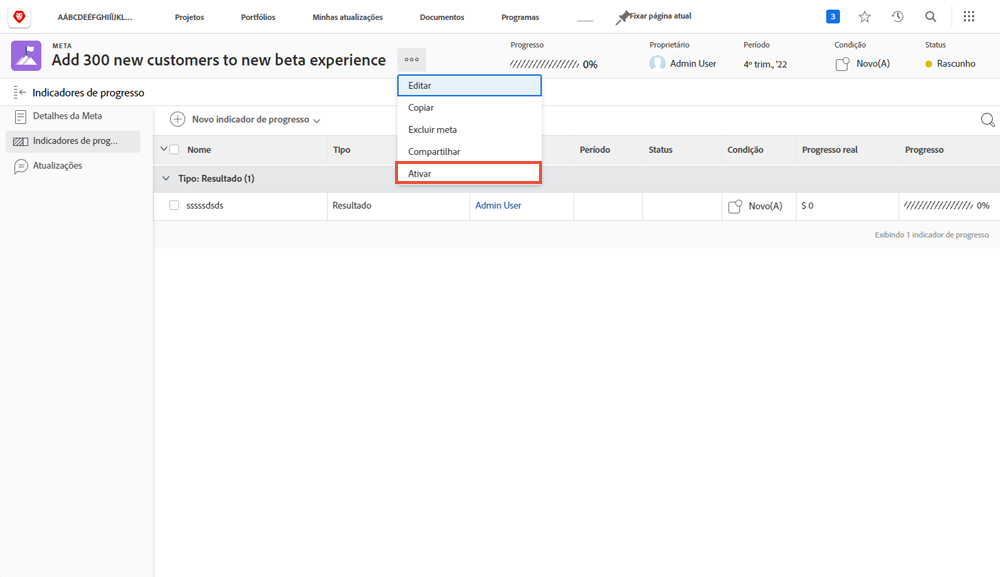

# Ativar metas

Agora que você criou as metas, está na hora de ativá-las. Ao criar uma meta, ela é salva com o status [!UICONTROL Rascunho]. As metas de [!UICONTROL rascunho] não fazem parte do gerenciamento de metas até que sejam ativadas. Uma vez ativadas, elas mudam para o status [!UICONTROL Ativo], mostrando o progresso no painel e como elas se alinham à estratégia geral. As metas com o status [!UICONTROL Ativo] são associadas a um indicador de progresso, geralmente uma atividade, resultado, projeto ou meta alinhada (relação entre metas principais e secundárias).

## Os indicadores de progresso são necessários para ativar metas

Antes de prosseguir, é importante compreender os indicadores de progresso utilizados no [!DNL Workfront Goals]. Os indicadores de progresso são os objetos usados pelo [!DNL Goals] para calcular o progresso de uma meta. Esses indicadores são: resultados, atividades, projetos e metas alinhadas. Você aprenderá sobre isso em mais detalhes posteriormente. Por enquanto, é importante entender que os resultados, atividades, projetos e metas alinhadas devem ser adicionados a uma meta para ativá-la.

Para adicionar um indicador de progresso, abra a meta e selecione a guia “Indicadores de progresso” à esquerda e, em seguida, o menu suspenso “Novo indicador de progresso” ao lado dela.

Os projetos são um pouco diferentes em comparação com outros indicadores de progresso, pois são considerados um tipo de atividade. As atividades podem ser separadas em dois tipos: barra de progresso manual e projetos. Como resultado, os projetos também impulsionam o progresso. Embora todos os tipos de indicador de progresso possam ser conectados a uma meta principal, é importante lembrar que há diferenças na forma de gerenciá-los.

## Hora de ativar a meta

Quando você tiver pelo menos um indicador de progresso na sua meta, verá a opção “Ativar” ao clicar no menu de três pontos ao lado do nome da meta.

