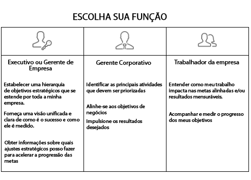

# Configurar o [!UICONTROL Workfront Goals] para a organização

*Esta seção é destinada a admins de sistema do [!DNL Workfront] que são responsáveis por configurar o Workfront Goals para os usuários.*

Para garantir que a organização avance rapidamente, você deve se certificar de que a execução do trabalho está alinhada com a estratégia da empresa. O [!DNL   Goals] coordena a estratégia, as metas e o trabalho para orientar a execução em toda a organização e fornecer resultados comerciais mensuráveis.

As práticas recomendadas para metas começam com objetivos corporativos de nível superior e depois descem para os níveis de grupo, de equipe e individual. As metas resultantes devem estar alinhadas, contribuir e apoiar o alcance das prioridades corporativas. No [!DNL Workfront], as metas são apoiadas por resultados ou atividades que indicam como elas podem ser alcançadas.

## Lista de verificação do [!DNL Workfront Goals]

As seguintes condições devem ser atendidas para que você possa acessar o [!DNL   Goals]:

* A organização deve comprar uma licença do [!DNL Workfront Goals], além da licença do [!DNL Workfront].
* A organização deve estar usando a interface da nova experiência do [!DNL Workfront]. O [!DNL Workfront Goals] não está disponível na interface clássica do [!DNL Workfront].
* Os usuários do [!DNL Workfront Goals] devem receber acesso ao [!DNL Workfront Goals] em seu nível de acesso.
* Você deve atribuir um modelo de layout que inclua a área do [!DNL Workfront Goals] no menu principal para que os usuários acessem a funcionalidade.

## Quem pode usar o [!DNL Workfront Goals]

Embora colaboradores individuais muitas vezes tenham metas pessoais, recomendamos usar o [!DNL Workfront Goals] para apoiar o trabalho da organização em prol da conquista dos objetivos estratégicos. Todos na organização devem ser incentivados a definir metas alinhadas à estratégia geral da empresa e que se conectem com suas atividades diárias.

Leia as descrições das funções abaixo e determine qual é a sua função no [!DNL Workfront Goals].

Executivos e gerentes podem usar o [!DNL Workfront Goals] para:

* Estabeleça uma hierarquia de metas estratégicas que seja aplicada em cascata em toda a empresa.
* Forneça uma visão unificada e clara do que é o sucesso e de como ele é medido.
* Obtenha insights sobre quais ajustes estratégicos podem ser feitos para acelerar a progressão das metas.

Colaboradores individuais podem usar o [!DNL Workfront Goals] para:

* Alinhar suas metas com as iniciativas estratégicas gerais da empresa.
* Medir o progresso e a realização em relação às metas estratégicas.
* Ajustar as metas pessoais conforme necessário para permanecer em alinhamento com a direção dos negócios.

